# 布局和堆栈

## 元素左对齐

选中堆栈，设置对齐方式：

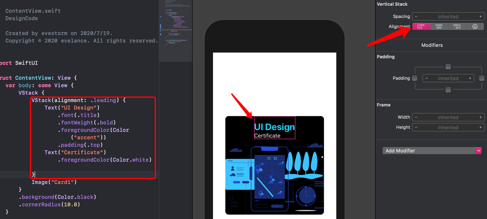

## 设置一个元素相对于一个堆栈对齐

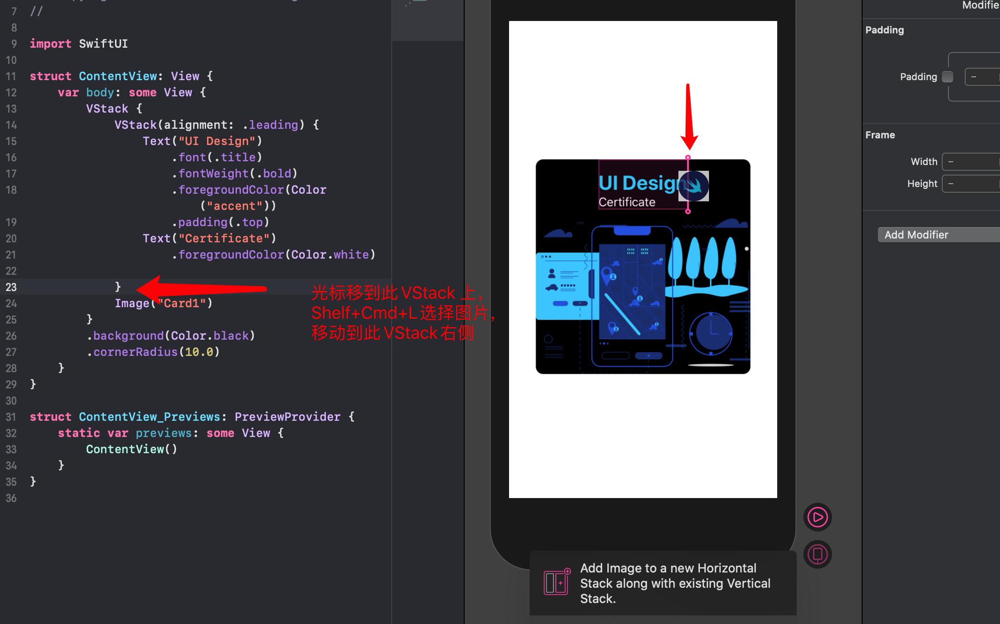

## (Spacer)撑开元素与堆栈之间的间距

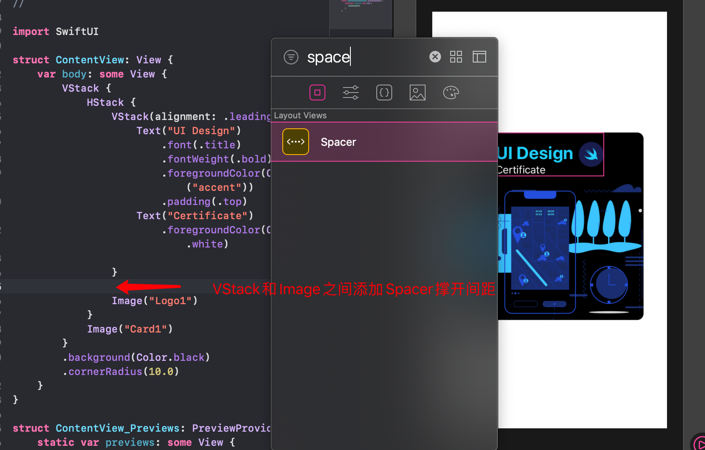

## 设置图片大小

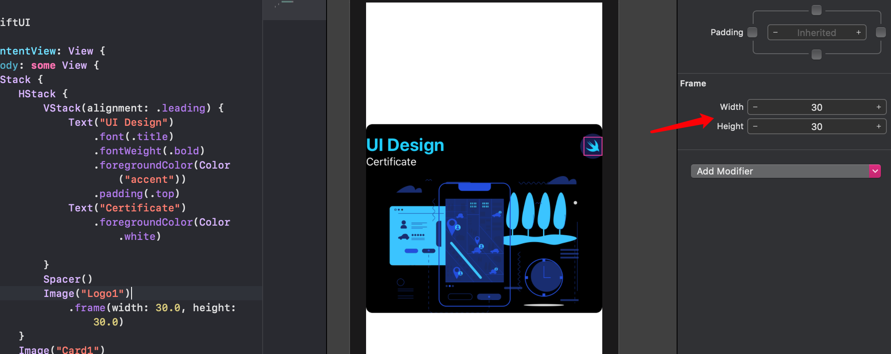

但默认情况下，图片不可调整大小，所以要加上 `resizable` 修饰符：

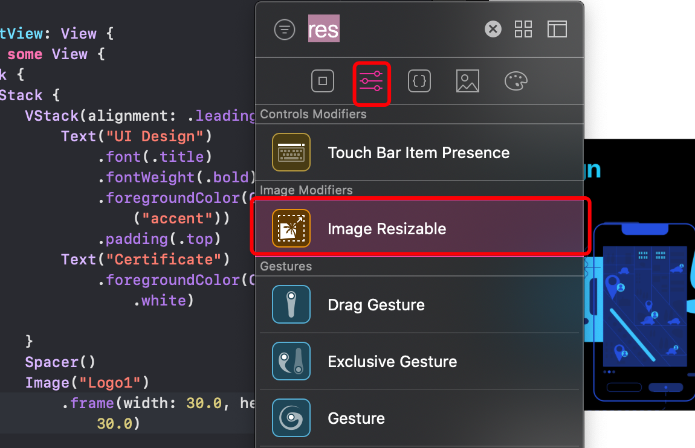

而且 `resizable` 修饰符得放在frame之前：

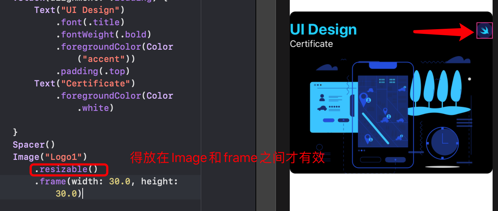

## 添加阴影

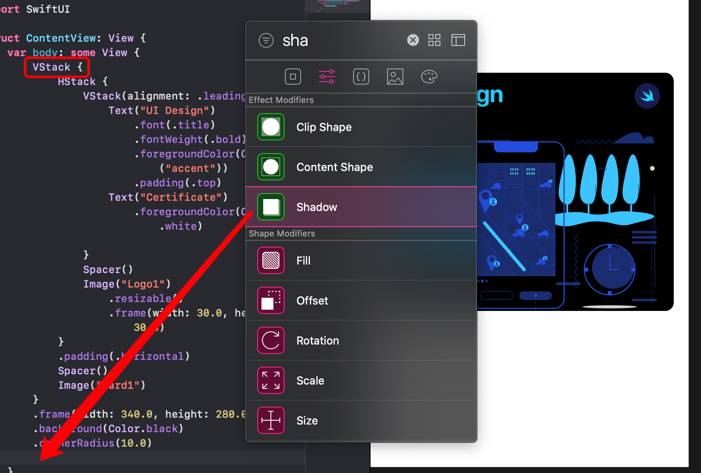

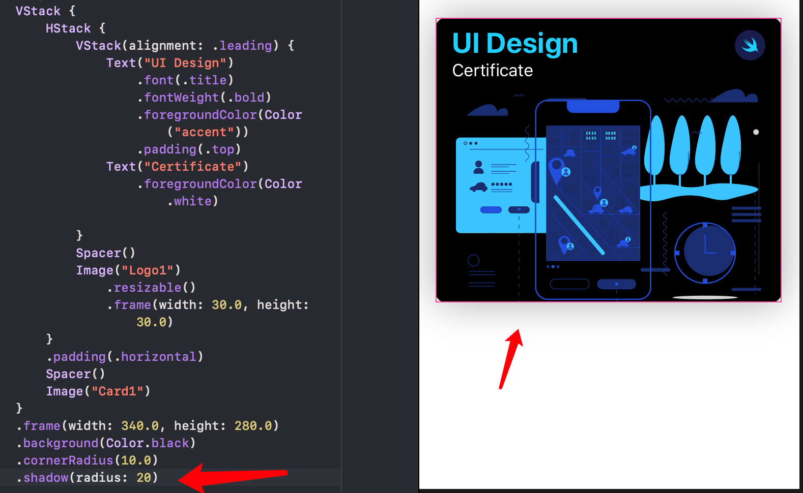

## （ZStack）三维Stack

让卡片堆叠，实现三维效果。

### 1. 将外层 Stack 嵌入到一个新的 Stack 中

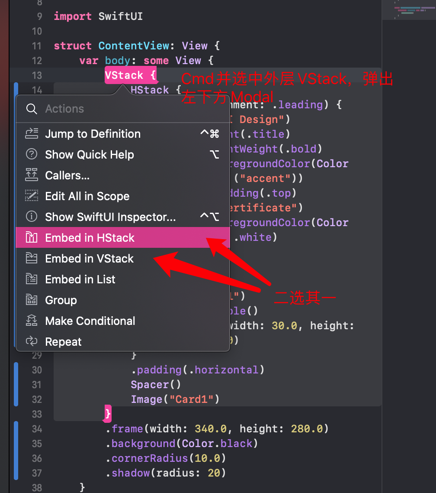

然后将新创建的 `VStack/HStack` 改为 `ZStack` :

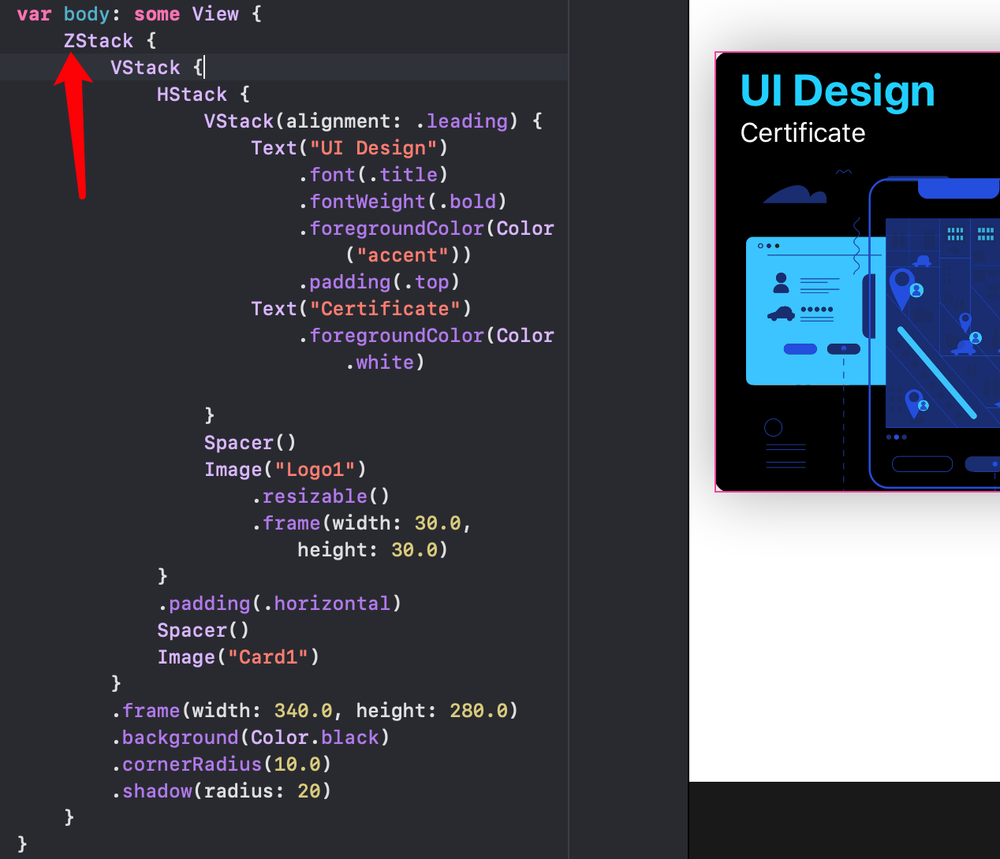

### 2. 创建新卡片（VStack）

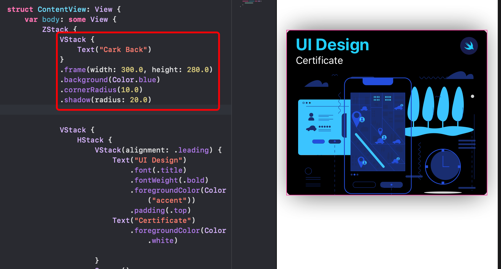

然后设置它的偏移量：

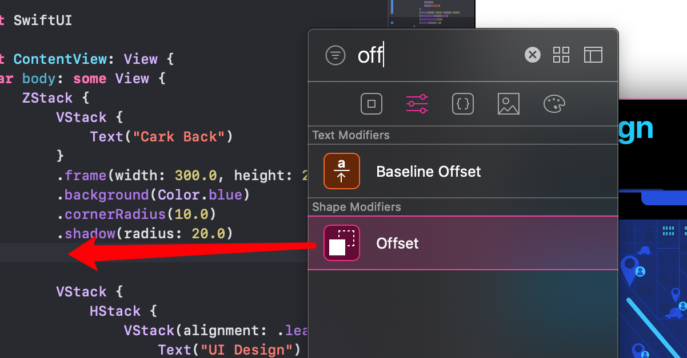

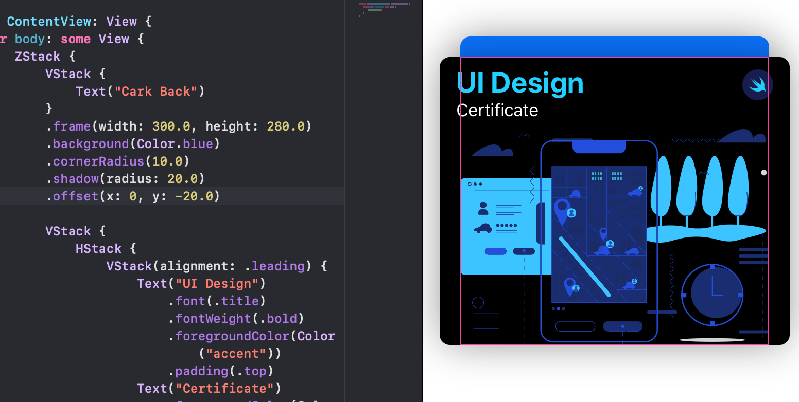

