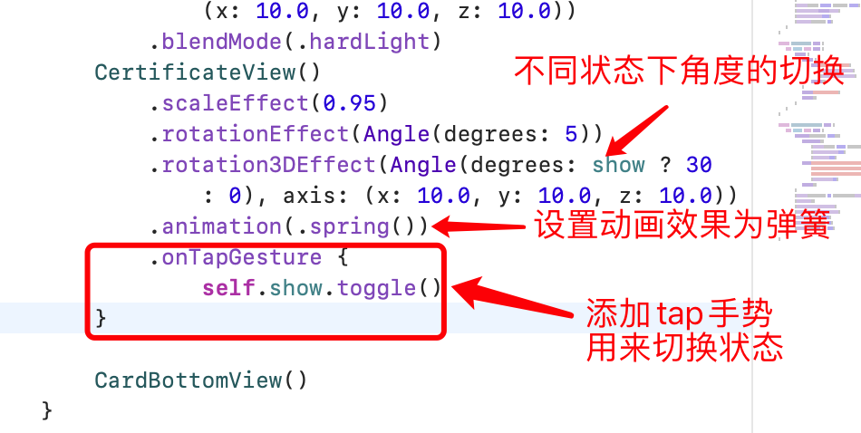
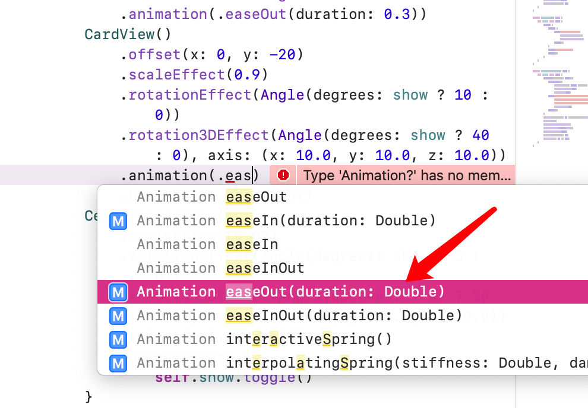
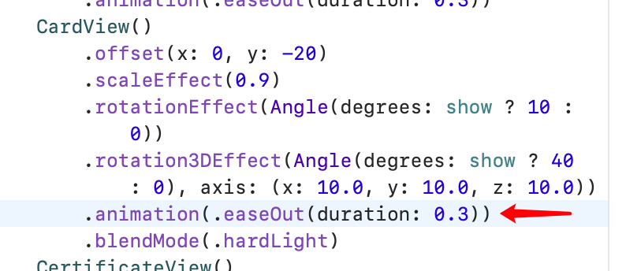

# 动画和状态

## 定义状态，设置动画


下面我们来给最上方的黑色卡片设置动画。

首先定义一个状态变量 show ，并用装饰器 `@State` 修饰。

>  通过使用 @State 修饰器我们可以关联出 View 的状态. SwiftUI 将会把使用过 @State 修饰器的属性存储到一个特殊的内存区域，并且这个区域和 View struct 是隔离的. 当 @State 装饰过的属性发生了变化，SwiftUI 会根据新的属性值重新创建视图



接着设定 show 为 true 时，卡片旋转 30 度，否则为 0 。并给卡片添加手势 `onTapGesture` ，当用户点击卡片时切换 show 的真假状态。最后为卡片添加 `animation` 动画效果。

### 动画效果


### 设置动画持续时间





另一种弹簧配置：

```swift
//response：控制动画持续时间
//dampingFraction：阻尼控 0代表永远反弹，大于1不会反弹
.animation(.spring(response: 0.5,
dampingFraction: 0.5, blendDuration: 0))
```

