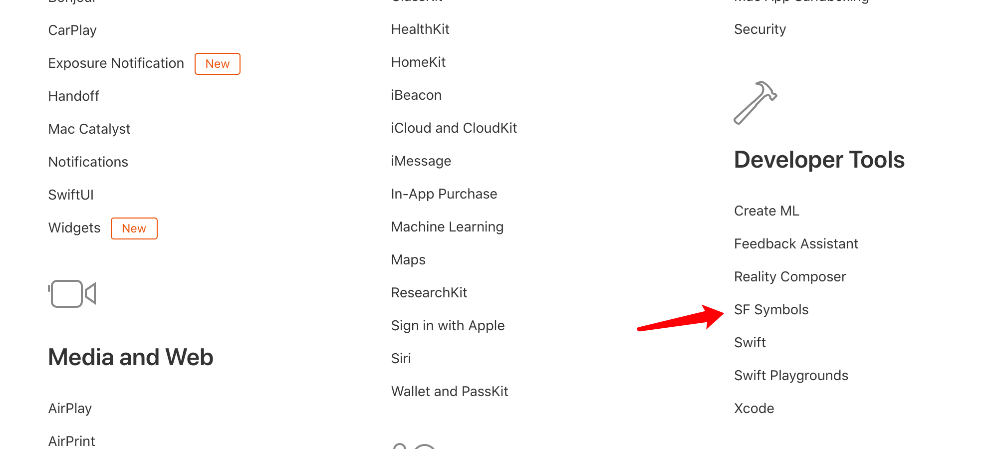
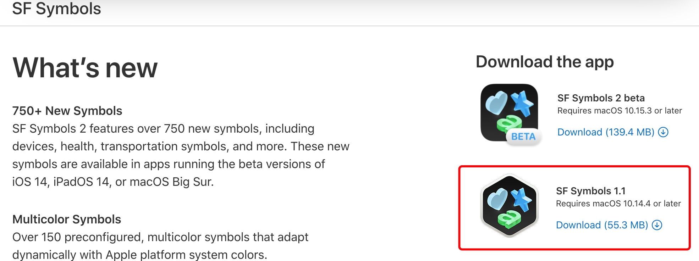
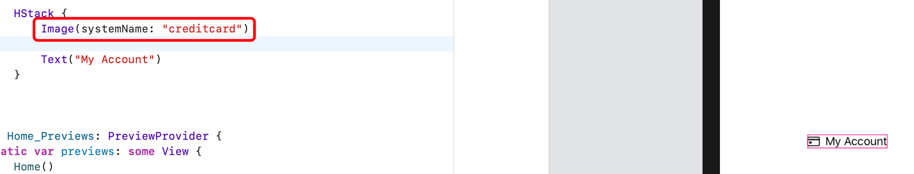

# SF符号和道具

## 下载SF符号

来到 https://developer.apple.com/develop/ 点击此处链接：



来到 https://developer.apple.com/sf-symbols/ 后直接下载安装：



## 使用 SF 符号

打开 SF Symbols 应用，找到你想要的符号。

添加图片并使用 systemName，名称就是 SF Synbols 上对应图标的名称 ：



设置图片样式：


## 给抽出的组件View添加自定义属性

```swift
struct Home: View {
    var body: some View {
        VStack {
            // MenuRow 为抽离的组件
            MenuRow(image: "person.crop.circle", text: "My Account")
            MenuRow()
            MenuRow()
        }
    }
}

struct Home_Previews: PreviewProvider {
    static var previews: some View {
        Home()
    }
}

struct MenuRow: View {
    // 设置外部传入的变量
    var image = "creditcard"
    var text = "My Account"
    var body: some View {##
        HStack {
            Image(systemName: image)
                .imageScale(.large)
                .foregroundColor(Color("background2"))
                .frame(width: 32, height: 32)
            Text(text)
                .font(.headline)
        }
    }
}
```

## 抽离代码后的subView如何传参：

```swift
// MARK: 子视图
struct MenuRow: View {
    var image = "creditcard"
    var text = "My Account"
    var body: some View {
        HStack {
            Image(systemName: image)
                .imageScale(.large)
                .foregroundColor(Color("background2"))
                .frame(width: 32, height: 32)
            Text(text)
                .font(.headline)
            Spacer()
        }
    }
}

VStack(alignment: .leading, spacing: 30) {
            MenuRow(image: "person.crop.circle", text: "My Account")
            MenuRow(image: "creditcard", text: "Billing")
            MenuRow(image: "person.and.person", text: "Team")
            MenuRow(image: "arrow.uturn.down", text: "Sign out")
            Spacer()
        }
				.padding(.top, 20)
        .padding(30) // 内边距
        .frame(minWidth: 0, maxWidth: .infinity)
        .background(Color.white)
        .cornerRadius(30)
        .padding(.trailing, 60) // 容器距离右边缘60像素
        .shadow(radius: 20)
```

