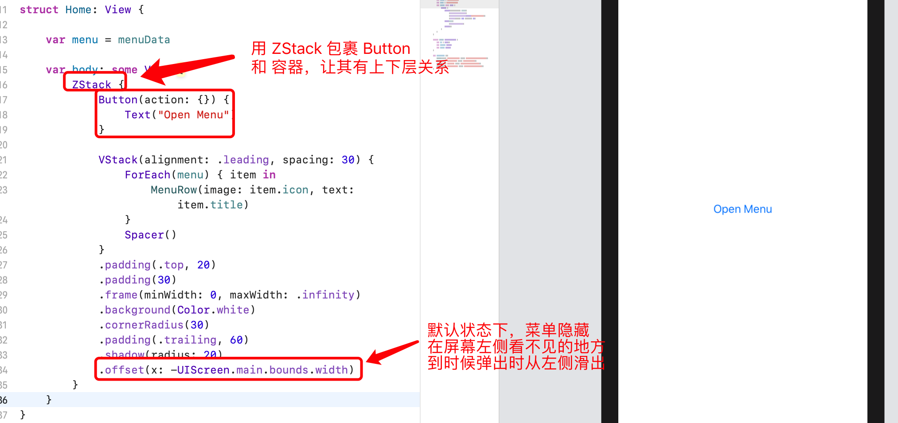
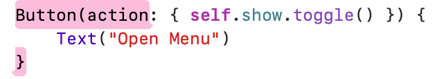
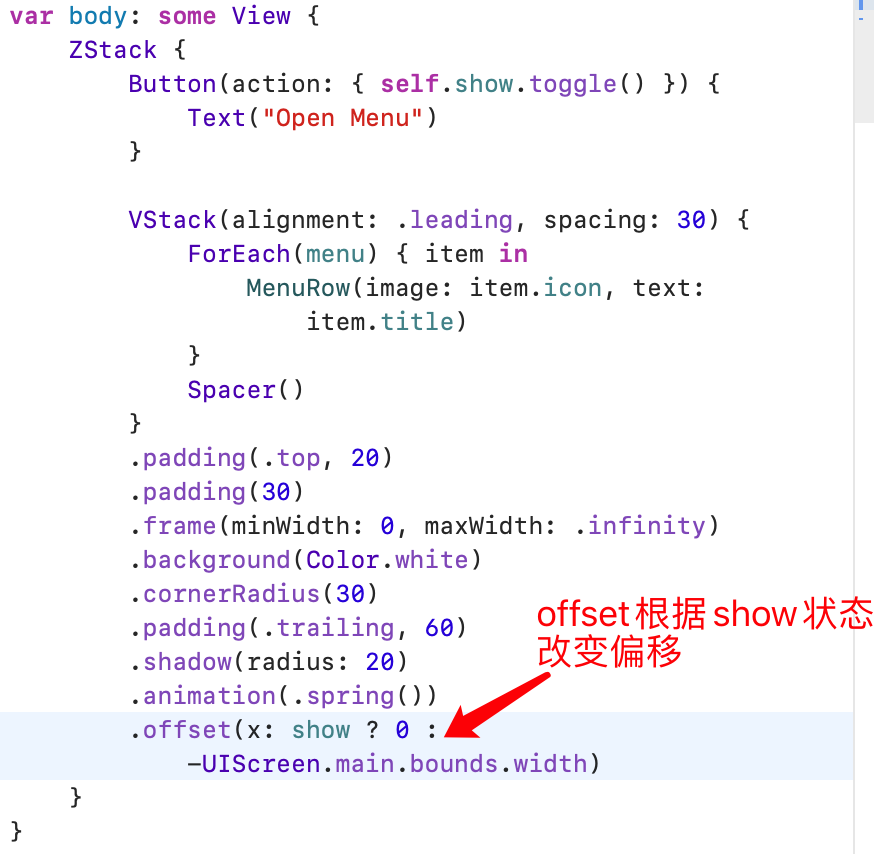
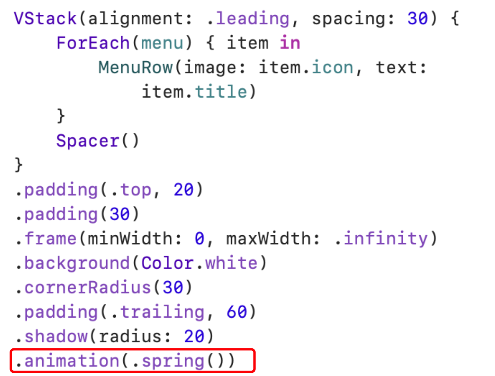
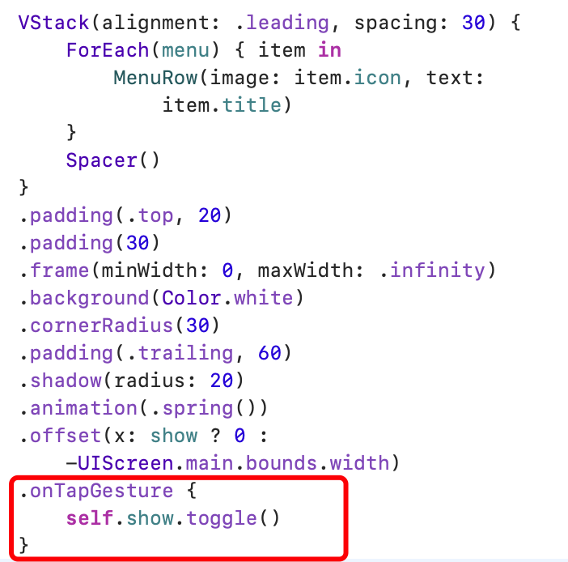
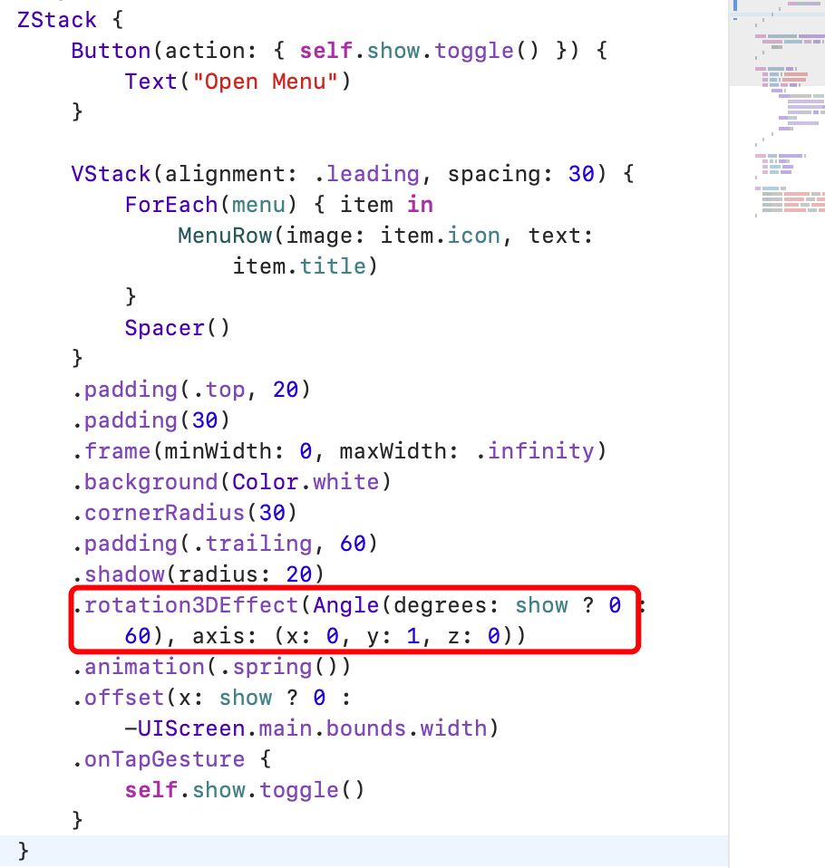
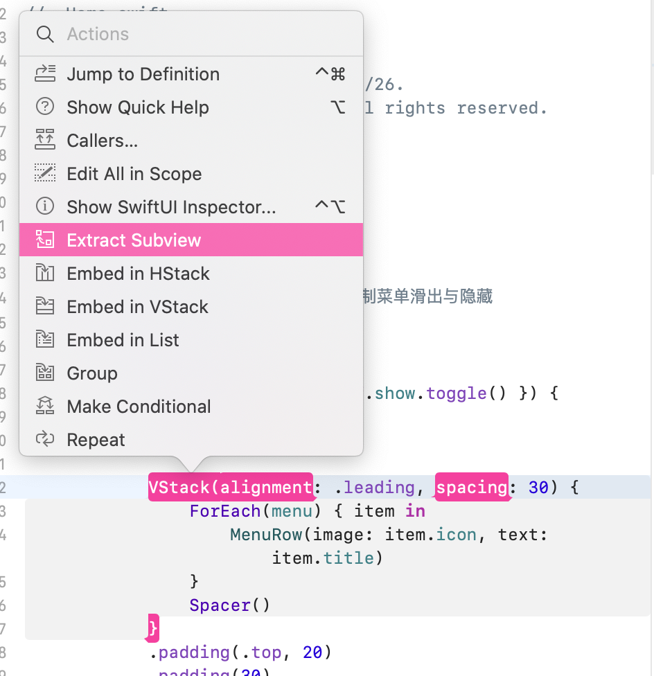
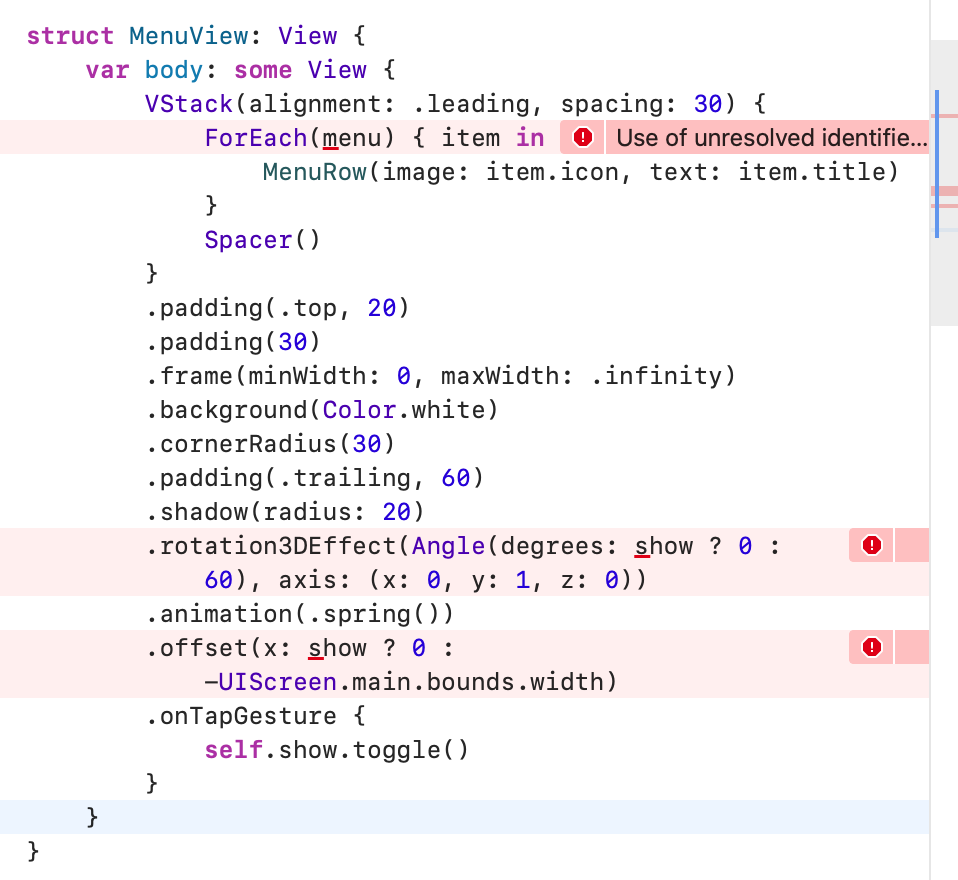
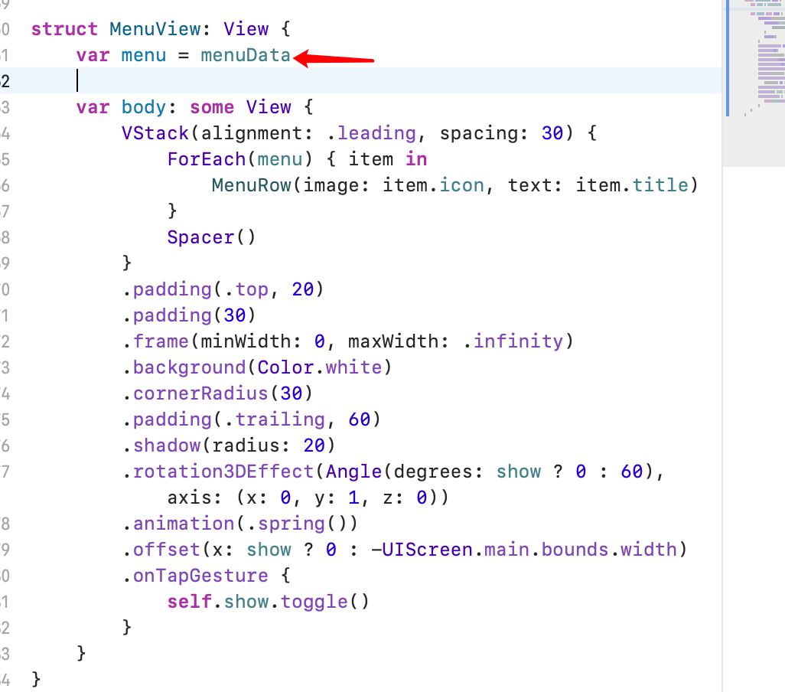
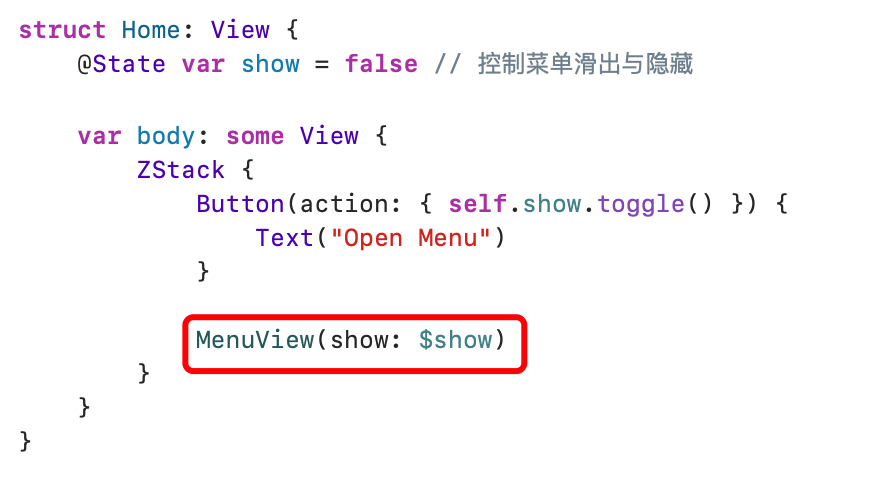

# 菜单动画和绑定

## 添加按钮用来切换菜单的弹出和隐藏



## 为按钮添加动作



```swift
Button(action: { self.show.toggle() }) {
  Text("Open Menu")
}
```



给菜单添加 `animation` 弹性动画：



然后，在Menu上添加tap事件用来隐藏自己：



最后为菜单添加3d旋转效果：



关于3d变化的讲解，可点击[此处](https://daddycoding.com/2020/03/19/swiftui-rotation-effect/)了解更多。

## 抽离组件

按照之前方案抽离菜单组件：



但下方会出现报错：



因为缺少一些必要的参数。我们先把之前主视图的 `menu` 变量移过来：



然后在子视图中新建一个 show 变量，并在前面用 `@Binding` 修饰，这是为了让子视图的属性和它父视图的属性建立关联。因为我们在 `MenuView` 中修改了 show 状态的值，并且希望这个状态能同步修改父视图中的 show 属性值。

为了实现这一点，我们有三个必要事情要做：

1. 第一步就得在子视图的 show 属性前添加关键词 `@Binding` （已完成）
2. 父视图的属性前面得用 `@State` 修饰（已完成）
3. 当把父视图的`@State`属性传到子视图的时候，在属性名前面加上`$`。

这样我们就建立了关联。

前两步已完成，现在该传递参数了：

```swift
MenuView(show: $show)
```



