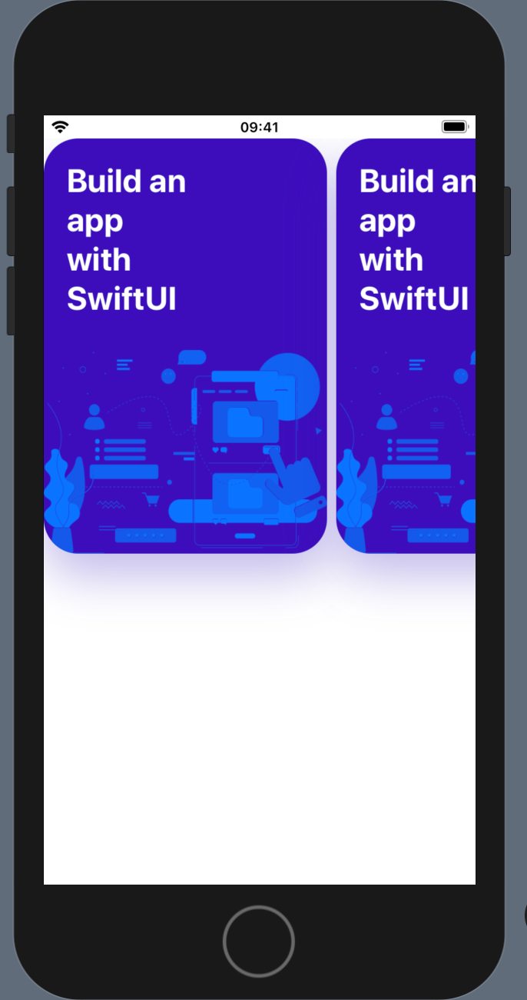
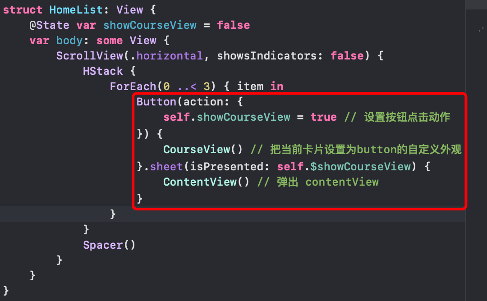

## 模态弹窗

我们希望点击卡片时弹出之前创建的 `ContentView` ：




## 弹出模态窗



## renderingMode 设置图片渲染模式

```js
Image("Card2").
	renderingMode(.original)
.none // 根据图片的使用环境和所处的绘图上下文自动调整渲染模式
.original // 始终绘制图片原始状态，不使用Tint Color
.template // 始终根据Tint Color绘制图片，忽略图片的颜色信息
```

## aspectRatio 纵横比

```js
Image(image)
  .renderingMode(.original)
  .resizable()
  .aspectRatio(contentMode: .fit)
.fit // 保持图片原比例，尽可能让图片全部显示出来，Image 剩下空出来的部分是透明的
.fill // 保持图片原比例，填满整个Image（图片可能会被裁剪掉）
```

