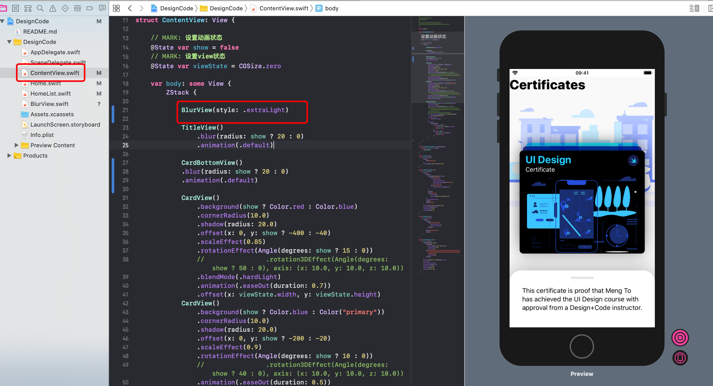

# 模糊背景

创建 `BlurView.swift` SwiftUI 文件：

```swift
//
//  BlurView.swift
//  DesignCode
//
//  Created by evestorm on 2020/7/27.
//  Copyright © 2020 evelance. All rights reserved.
//

import SwiftUI

struct BlurView: UIViewRepresentable {
    
    let style: UIBlurEffect.Style
    
    func makeUIView(context: UIViewRepresentableContext<BlurView>) -> UIView {
        let view = UIView(frame: .zero)
        view.backgroundColor = .clear
        let blurEffect = UIBlurEffect(style: style)
        let blurView = UIVisualEffectView(effect: blurEffect)
        blurView.translatesAutoresizingMaskIntoConstraints = false
        view.insertSubview(blurView, at: 0)
        NSLayoutConstraint.activate([
            blurView.heightAnchor.constraint(equalTo: view.heightAnchor),
            blurView.widthAnchor.constraint(equalTo: view.widthAnchor),
        ])
        return view
    }
    
    func updateUIView(_ uiView: UIView,
                      context: UIViewRepresentableContext<BlurView>) {
    }
}

struct BlurView_Previews: PreviewProvider {
    static var previews: some View {
        BlurView(style: .regular)
    }
}
```

在 `ContentView` 中使用：



