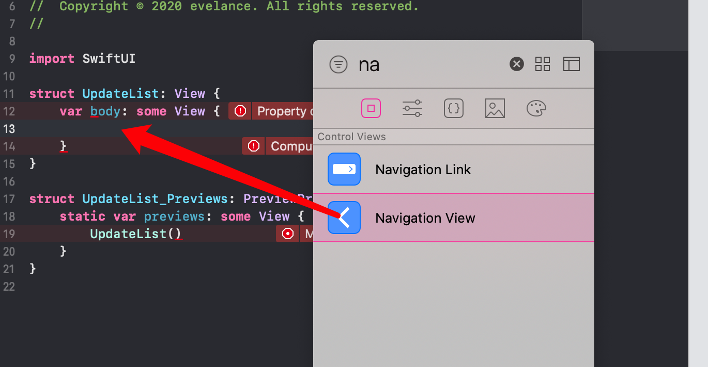
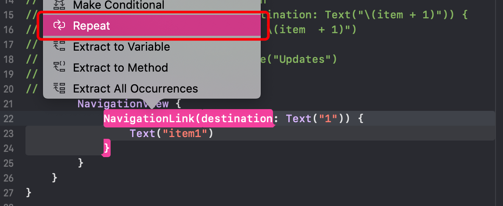
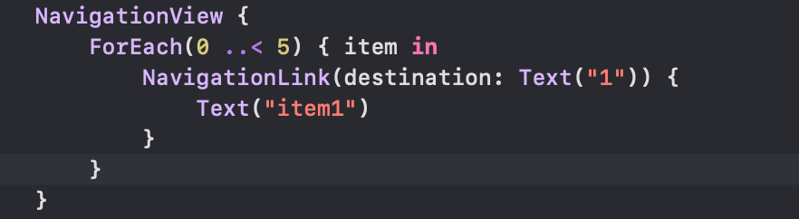
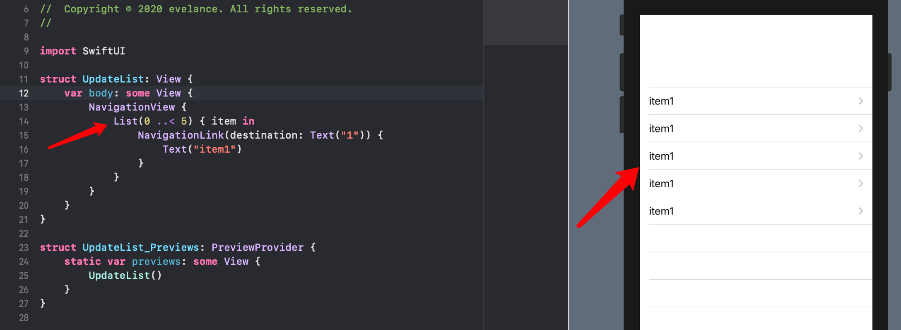
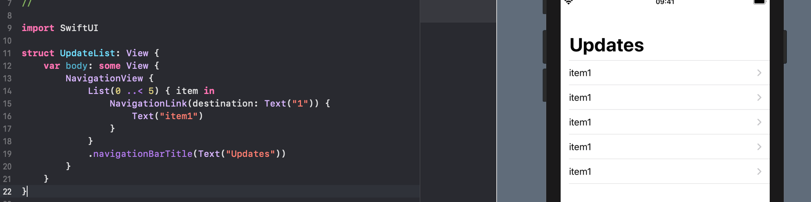
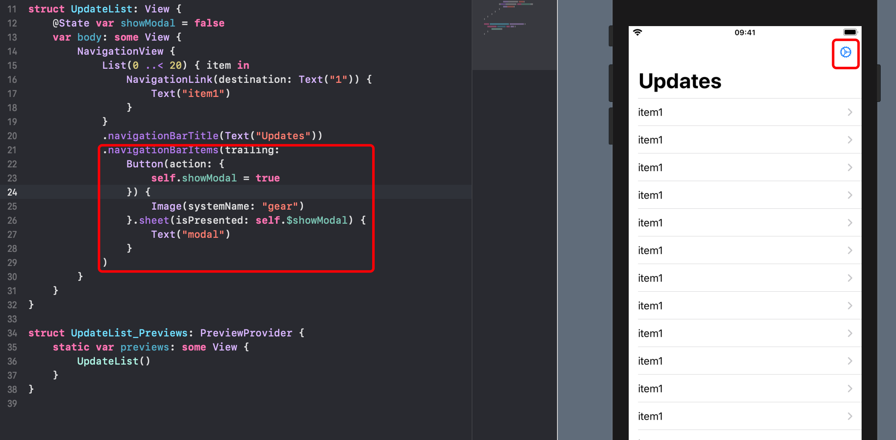
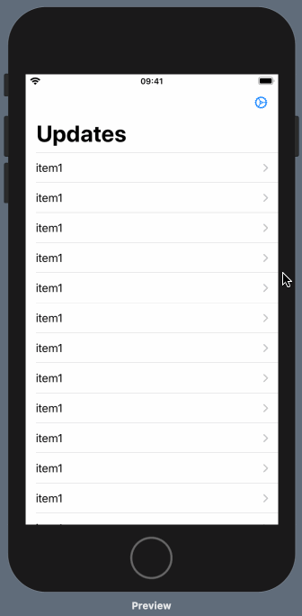
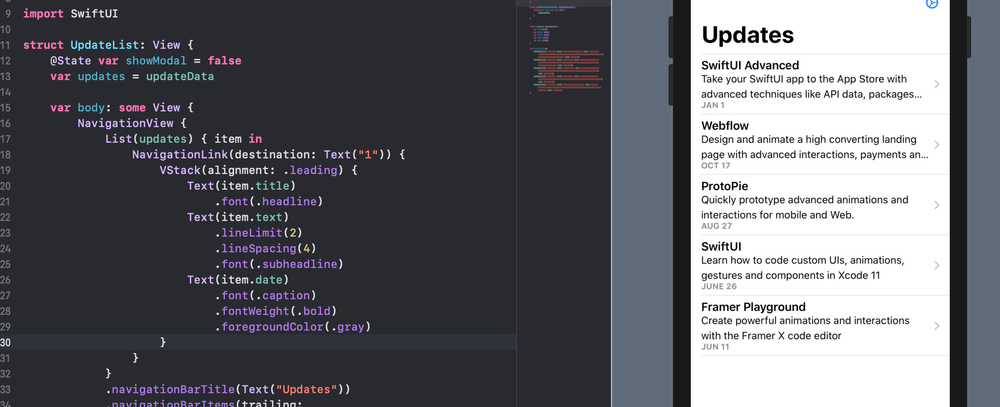

# 导航视图和列表

## navigationView 添加导航视图



填充参数：

```swift
NavigationView {
  NavigationLink(destination: Text("1")) {
    Text("item1")
  }
}
```

循环列表：





改 `Foreach` 为 `List` ：



### 设置列表标题



### 设置右上角按钮



](./images/showModalright.gif)

### 设置列表样式



