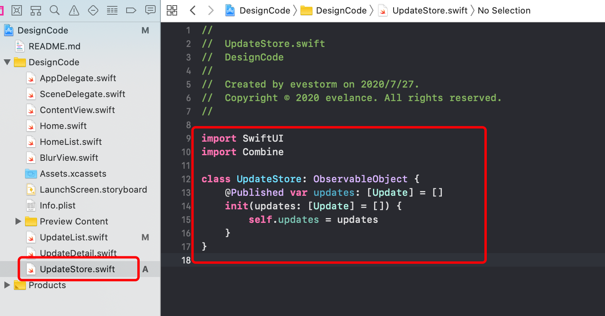

# 合并和编辑数据

## @ObservedObject

>  @ObservedObject 的用处和 @State 非常相似，从名字看来它是来修饰一个对象的，这个对象可以给多个独立的 View 使用。如果你用 @ObservedObject 来修饰一个对象，那么那个对象必须要实现 ObservableObject 协议，然后用 @Published 修饰对象里属性，表示这个属性是需要被 SwiftUI 监听的

新建 `UpdateStore.swift` 文件用来创建列表对象：

```swift
import SwiftUI
import Combine

class UpdateStore: ObservableObject {
    @Published var updates: [Update] = []
    init(updates: [Update] = []) {
        self.updates = updates
    }
}
```



在 `UpdateList.swift` 文件中创建一个 `UpdateStore` 对象：


为列表添加移动和删除方法：

```swift
// 移动item
func move(from source: IndexSet, to destination: Int) {
  #warning("not use swap!!! crash!!!")
  store.updates.move(fromOffsets: source, toOffset: destination)
}

.onDelete { (indexSet) in
	self.store.updates.remove(at: indexSet.first!)
}
.onMove(perform: move)
```


新增按钮创建新增item方法：

```swift
// 新增item
func addItem() {
  store.updates.append(Update(image: "Card3", title: "newTitle", text: "newText", date: "JUN 26"))
}
```


## 参考来源

[[译\]理解 SwiftUI 里的属性装饰器@State, @Binding, @ObservedObject, @EnvironmentObject](https://www.cnblogs.com/xiaoniuzai/p/11417123.html)

