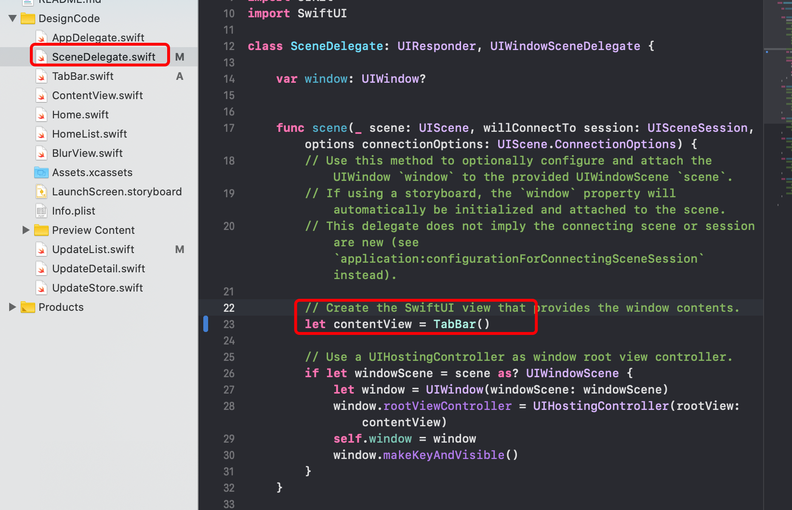

# Tabbar标签栏和设备上的测试

创建tabbar：

新建 `TabBar.swift` 文件：

```swift
import SwiftUI

struct TabBar: View {
    var body: some View {
        TabView {
            Home().tabItem({
                VStack {
                    Image(systemName: "house")
                    Text("Home")
                }
            })
            .tag(1)
            ContentView()
                .tabItem {
                    Image(systemName: "aspectratio")
                    Text("Certificates")
            }
            .tag(2)
            UpdateList()
                .tabItem {
                    Image(systemName: "gear")
                    Text("Updates")
            }
            .tag(3)
        }
    }
}

struct TabBar_Previews: PreviewProvider {
    static var previews: some View {
        TabBar()
    }
}

```

设置默认页为tabbar：



