# 暗黑模式和辅助功能

## 预览环境下设置暗黑模式

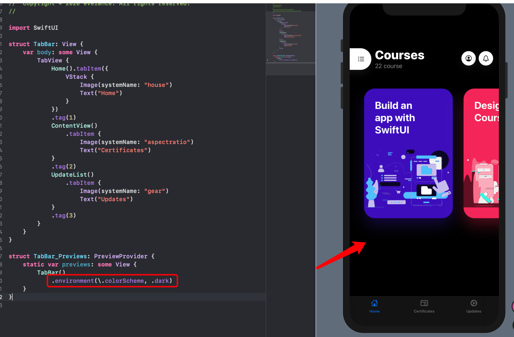

改模糊样式为 `.systemMaterial`

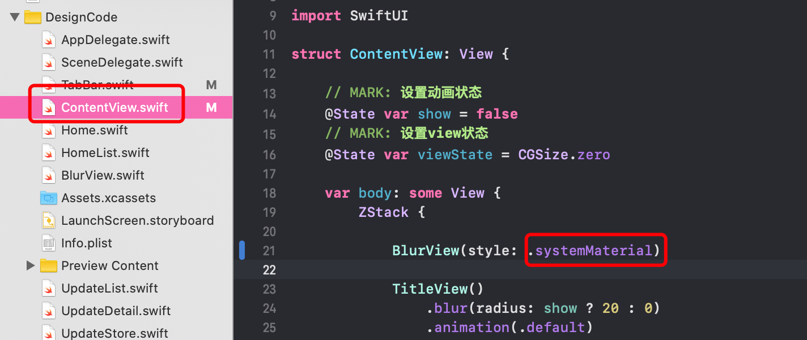

设置底部卡片的背景为系统材料：

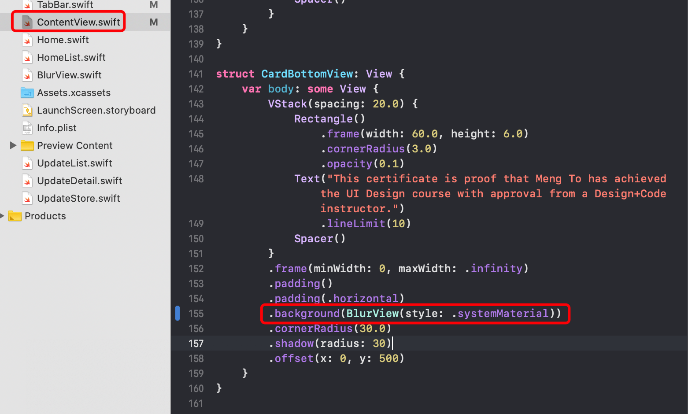

修改按钮样式：

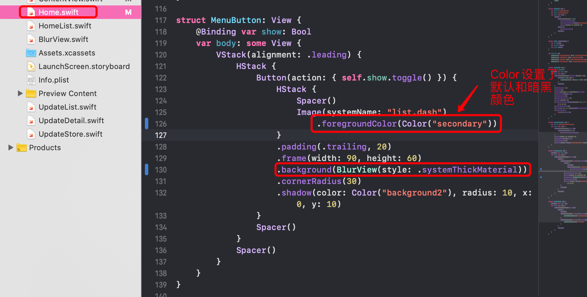

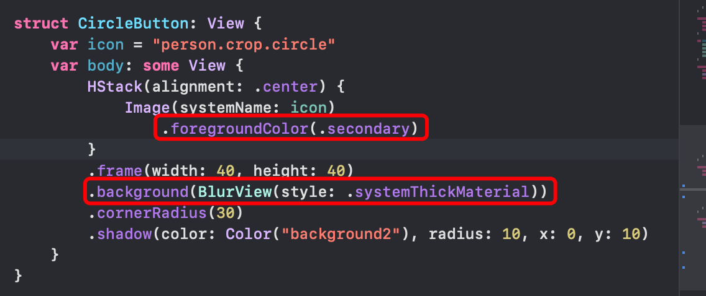

更新菜单栏样式：

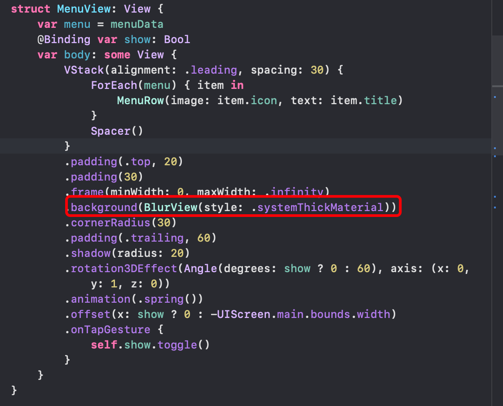

## 预览环境下设置系统大字体条件下页面的展示情况

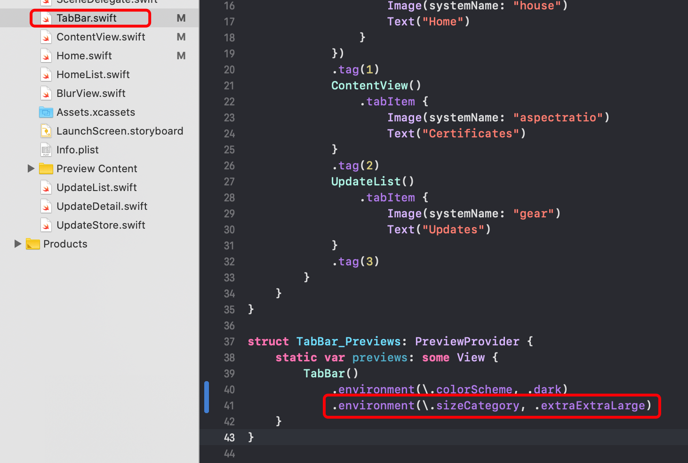

## 预览环境下同时预览光照模式和暗黑模式

对 `TabBar` 进行分组：

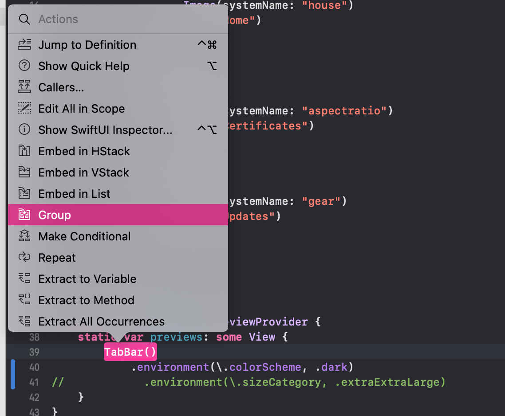

然后添加一个新的 `TabBar` ，同时停止右侧预览的运行：

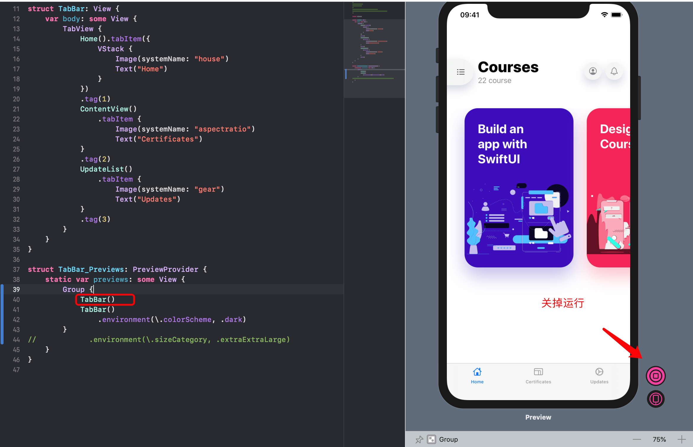

现在就能看到两个模式的效果了：

## 模拟器下切换光照暗黑模式

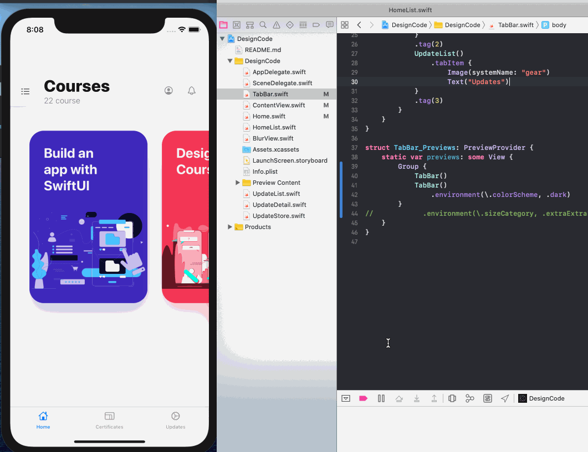

## 模拟器下切换字体大小

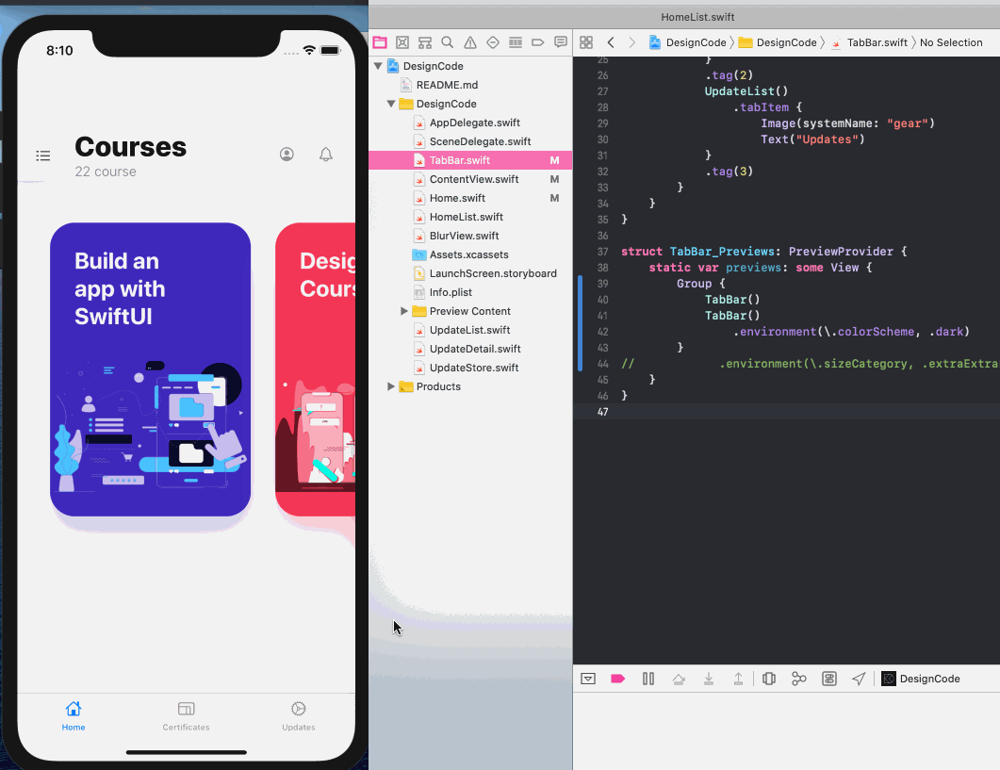

