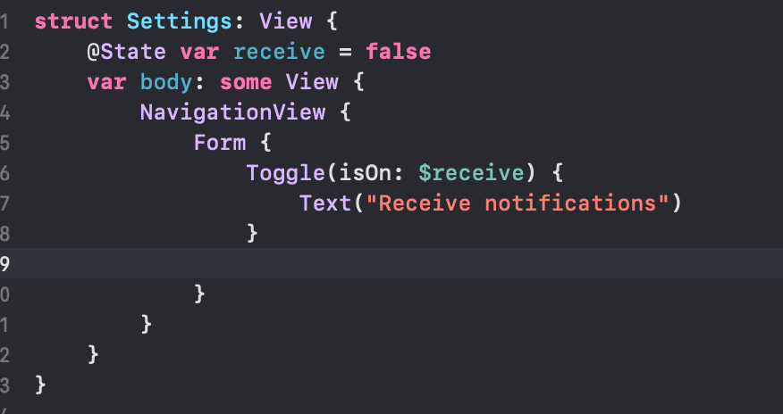
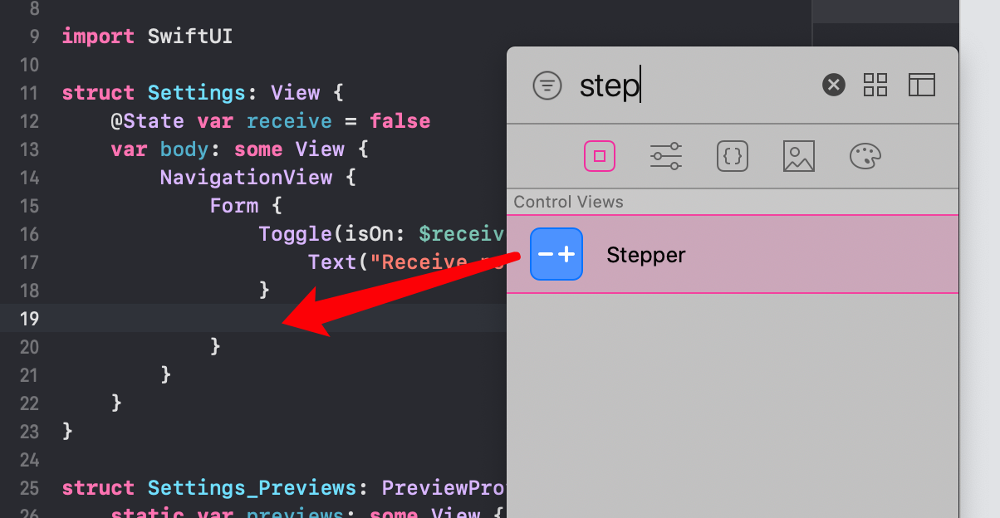
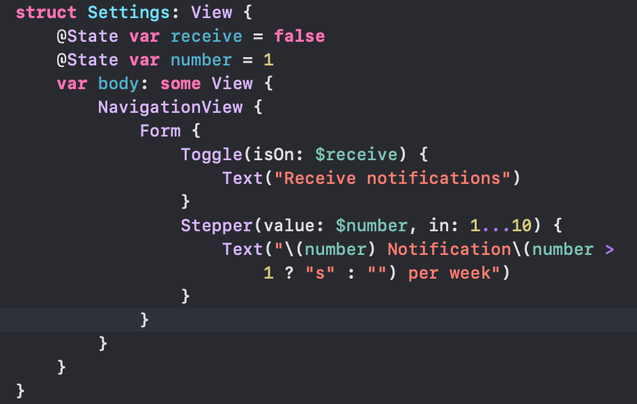
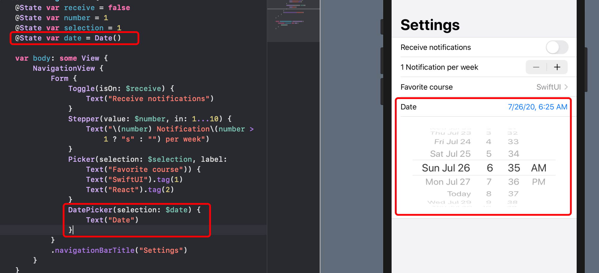
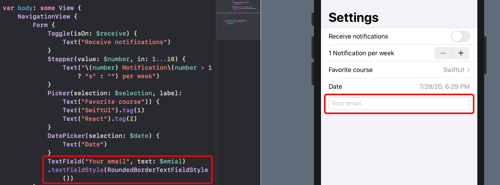
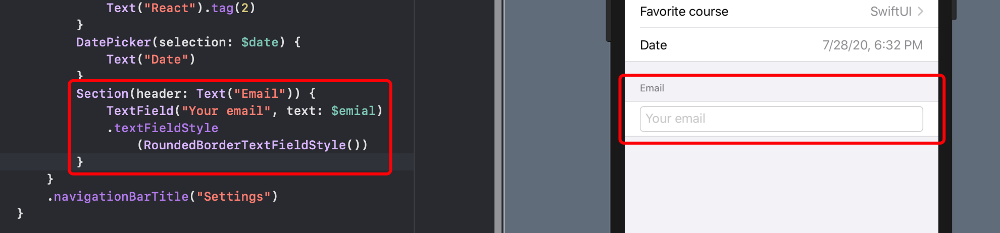
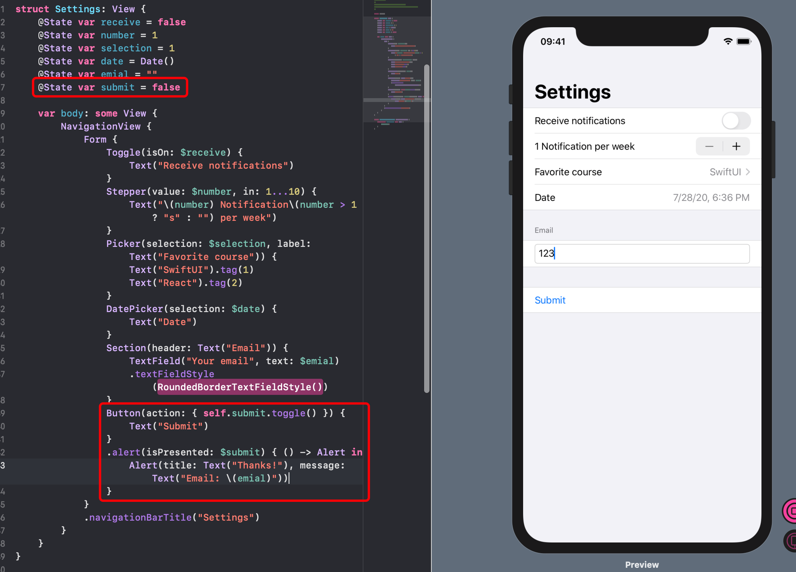
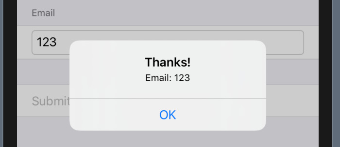

# Form 表单

## NavigationView

```swift
NavigationView {}
```

## 创建表单

```swift
struct Settings: View {
    var body: some View {
        NavigationView {
            Form {
                
            }
          	.navigationBarTitle("Settings")
        }
    }
}
```

## Toggle 开关




## Stepper 计步器





## Picker 选择器


## DatePicker 时间选择器



## TextField 文本域



## Section 给表单分组



## 提交并弹窗





