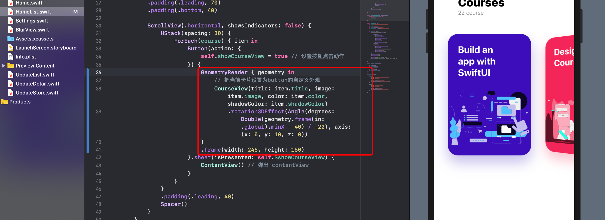
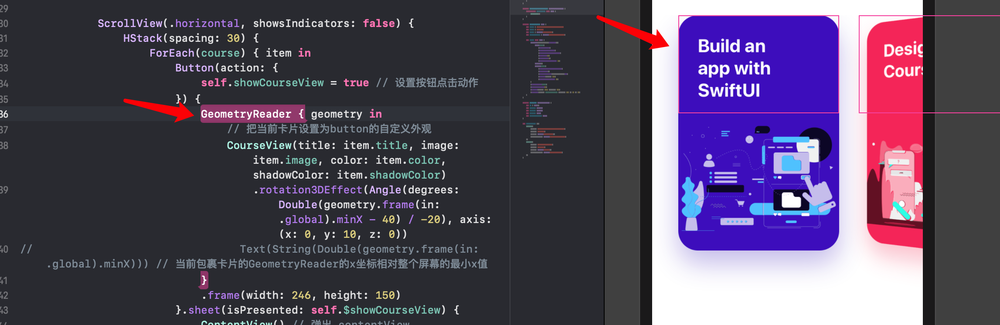

# 滚动动画

## GeometryReader 几何阅读器

>  一个容器View，根据其自身大小和坐标定义其内容。

1. 能够获取到父view建议的size
2. 可以通过 `frame(in:)` 函数，传入一个相对坐标系，可以获取 GeometryReader 相对某个 view 的 frame
3. 在某些特殊情况下，比如 ScrollView 中加入 GeometryReader ，如果使用了 `frame(in:)` 函数，返回的值会根据 view 的位置自动变化
   1. frame(in: .global) 相对整个屏幕
   2. frame(in: .named("xxx")) 相对某个view
   3. frame(in: .local) 相对 GeometryReader自身



```swift
geometry.frame(in: .global).minX
// 当前包裹卡片的GeometryReader的x坐标相对整个屏幕的最小x值
```



