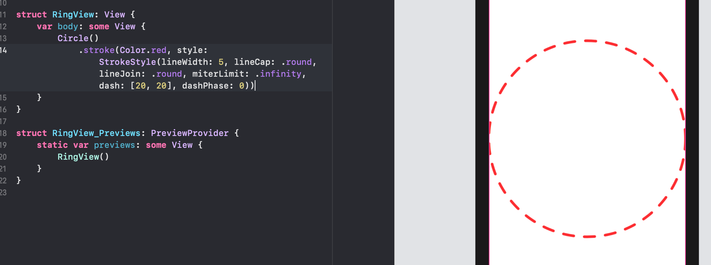
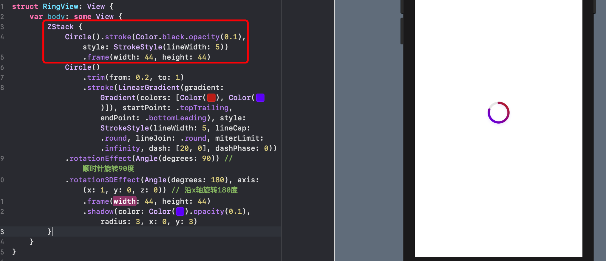

# 圆环进度条

## 圆环

### 纯色



```swift
lineWidth: 5, lineCap: .round, lineJoin: .round, miterLimit: .infinity, dash: [20, 0], dashPhase: 0)
线宽, 线端点, 线连接点, 最大斜接长度, 虚线[虚线长度，虚线之前间隔] 虚线阶段
```

### 渐变色


双击选择颜色：


### 裁剪


### 调整角度


### 设置圆环底色




