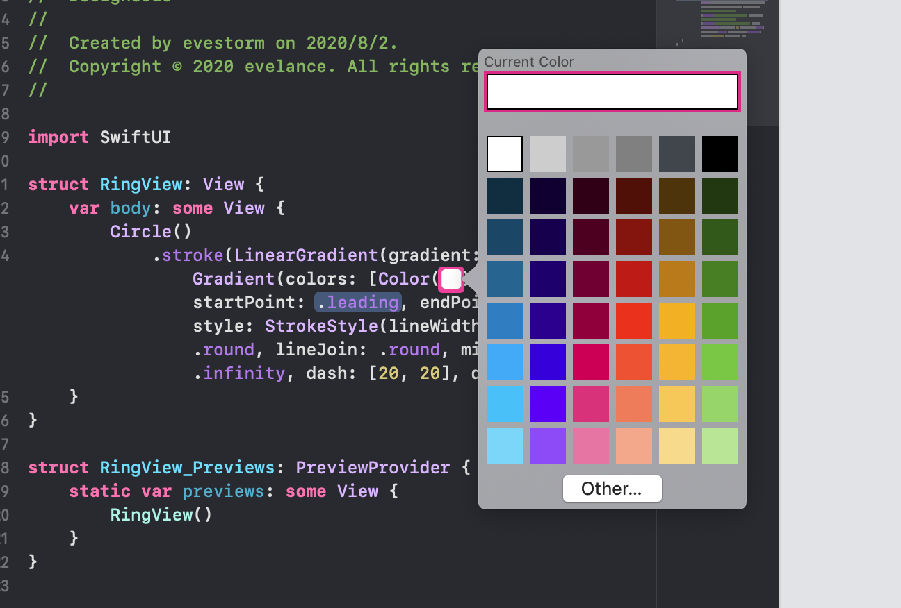
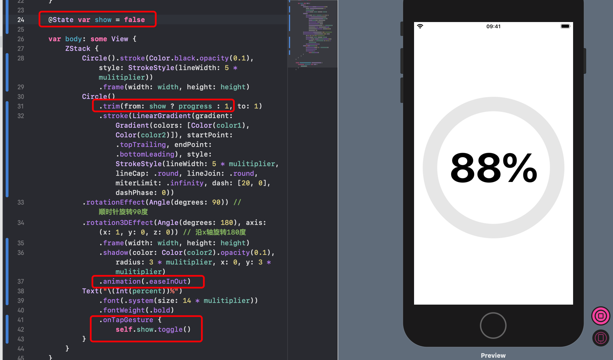

# 圆环进度条

## 圆环

### 纯色


```swift
lineWidth: 5, lineCap: .round, lineJoin: .round, miterLimit: .infinity, dash: [20, 0], dashPhase: 0)
线宽, 线端点, 线连接点, 最大斜接长度, 虚线[虚线长度，虚线之前间隔] 虚线阶段
```

### 渐变色


双击选择颜色：




### 裁剪


### 调整角度


### 设置圆环底色


## 自定义组件圆环进度条


### 设置动画和动画状态



为了能让外界控制组件的动画状态，改 show 的 @State 为 @Binding。改完会报三处错误：


修复错误：


## 使用自定义圆环

回到 `ContentView.swift` 文件

给底部BottomView添加圆环：


几个注意点：


延迟添加无效，得删除组件中动画效果：


因为组件内部动画效果优先级更高，内部没有设置延迟，导致外部对其设置的无效。

完整代码：

```swift
//
//  ContentView.swift
//  DesignCode
//
//  Created by evestorm on 2020/7/19.
//  Copyright © 2020 evelance. All rights reserved.
//

import SwiftUI

struct ContentView: View {
    
    // MARK: 设置动画状态
    @State var show = false
    // MARK: 设置view状态
    @State var viewState = CGSize.zero
    @State var showCard = false
    @State var bottomState = CGSize.zero
    @State var showFull = false
    
    var body: some View {
        ZStack {
            
            BlurView(style: .systemMaterial)
            
            TitleView()
                .blur(radius: show ? 20 : 0)
                .opacity(showCard ? 0.4 : 1)
                .offset(y: showCard ? -200 : 0)
                .animation(Animation.default.delay(0.1))
            
            BackCardView()
                .frame(width: showCard ? 300 : 340, height: 220)
                .background(show ? Color("card3") : Color("card4"))
                .cornerRadius(20)
                .shadow(radius: 20)
                .offset(x: 0, y: show ? -400 : -40)
                .offset(x: viewState.width, y: viewState.height)
                .offset(y: showCard ? -180 : 0)
                .scaleEffect(showCard ? 1 : 0.9)
                .rotationEffect(.degrees(show ? 0 : 10))
                .rotationEffect(Angle(degrees: showCard ? -10 : 0))
                .rotation3DEffect(Angle(degrees: showCard ? 0 : 10), axis: (x: 10, y: 0, z: 0))
                .blendMode(.hardLight)
                .animation(.easeOut(duration: 0.5))
            
            BackCardView()
                .frame(width: 340, height: 220)
                .background(show ? Color("card4") : Color("card3"))
                .cornerRadius(20)
                .shadow(radius: 20)
                .offset(x: 0, y: show ? -200 : -20)
                .offset(x: viewState.width, y: viewState.height)
                .offset(y: showCard ? -140 : 0)
                .scaleEffect(showCard ? 1 : 0.95)
                .rotationEffect(Angle.degrees(show ? 0 : 5))
                .rotationEffect(Angle(degrees: showCard ? -5 : 0))
                .rotation3DEffect(Angle(degrees: showCard ? 0 : 5), axis: (x: 10, y: 0, z: 0))
                .blendMode(.hardLight)
                .animation(.easeOut(duration: 0.3))
            
            CertificateView()
                .frame(width: showCard ? 375 : 340, height:  220)
                .background(Color.black)
                .clipShape(RoundedRectangle(cornerRadius: showCard ? 30 : 20, style: .continuous))
                .shadow(radius: 20)
                .offset(x: viewState.width, y: viewState.height)
                .offset(y: showCard ? -100 : 0)
                .blendMode(.hardLight)
                //                .rotation3DEffect(Angle(degrees: show ? 30 : 0), axis: (x: 10.0, y: 10.0, z: 10.0))
                //response：控制动画持续时间
                //dampingFraction：阻尼控制,0代表永远反弹，大于1不会反弹
                .animation(.spring(response: 0.3, dampingFraction: 0.6, blendDuration: 0))
                .onTapGesture {
                    self.showCard.toggle()
            }
            .gesture(
                DragGesture()
                    .onChanged({ value in
                        self.viewState = value.translation
                        self.show = true
                    })
                    .onEnded({ value in
                        self.viewState = CGSize.zero
                        self.show = false
                    })
            )
            
            CardBottomView(show: $showCard)
                .offset(x: 0, y: showCard ? 360: 1000)
                .offset(y: bottomState.height)
                .blur(radius: show ? 20 : 0)
                .animation(.timingCurve(0.2, 0.8, 0.2, 1, duration: 0.8))
                .gesture(
                    DragGesture().onChanged({ (value) in
                        self.bottomState = value.translation
                        if self.showFull {
                            self.bottomState.height += -300
                        }
                        if self.bottomState.height < -300 {
                            self.bottomState.height = -300
                        }
                    })
                    .onEnded({ (value) in
                        if self.bottomState.height > 50 {
                            self.showCard = false
                        }
                        if (self.bottomState.height < -100 && !self.showFull) ||
                            (self.bottomState.height < -250 && self.showFull) {
                            self.bottomState.height = -300
                            self.showFull = true
                        } else {
                            self.bottomState = .zero
                            self.showFull = false
                        }
                    })
            )
            
        }
        .padding()
    }
}

struct ContentView_Previews: PreviewProvider {
    static var previews: some View {
        ContentView()
    }
}

struct BackCardView: View {
    var body: some View {
        VStack {
            Spacer()
        }
        .frame(width: 340, height: 220)
    }
}

struct CertificateView: View {
    var item = Certificate(title: "UI Design", image: "Card1", width: 340, height: 220)
    var body: some View {
        VStack {
            HStack {
                VStack(alignment: .leading) {
                    Text(item.title)
                        .font(.title)
                        .fontWeight(.bold)
                        .foregroundColor(Color("accent"))
                        .padding(.top)
                    Text("Certificate")
                        .foregroundColor(Color.white)
                    
                }
                Spacer()
                Image("Logo1")
                    .resizable()
                    .frame(width: 30.0, height: 30.0)
            }
            .padding(.horizontal)
            Spacer()
            Image(item.image)
                .frame(minWidth: 0, maxWidth: .infinity, minHeight: 0, maxHeight: .infinity)
                .offset(y: 50)
        }
        .frame(width: item.width, height: item.height)
        .background(Color.black)
        .cornerRadius(10.0)
        .shadow(radius: 10)
    }
}

struct TitleView: View {
    var body: some View {
        VStack {
            HStack {
                Text("Certificates")
                    .font(.largeTitle)
                    .fontWeight(.heavy)
                Spacer()
            }
            .padding()
            Image("Background1")
            Spacer()
        }
    }
}

struct CardBottomView: View {
    @Binding var show: Bool
    
    var body: some View {
        VStack(spacing: 20.0) {
            Rectangle()
                .frame(width: 40, height: 5)
                .cornerRadius(3.0)
                .opacity(0.1)
            Text("This certificate is proof that Meng To has achieved the UI Design course with approval from a Design+Code instructor.")
                .multilineTextAlignment(.center)
                .font(.subheadline)
                .lineLimit(4)
            
            RingView(color1: #colorLiteral(red: 0.2588235438, green: 0.7568627596, blue: 0.9686274529, alpha: 1), color2: #colorLiteral(red: 0.2196078449, green: 0.007843137719, blue: 0.8549019694, alpha: 1), width: 88, height: 88, percent: 78, show: $show)
                .animation(Animation.easeInOut.delay(0.3))
            
            Spacer()
        }
        .padding(.top, 8)
        .padding(.horizontal, 20)
        .frame(minWidth: 0, maxWidth: .infinity)
        .background(BlurView(style: .systemMaterial))
        .cornerRadius(30)
        .shadow(radius: 20)
    }
}
```

