# 自定义修饰符

## 创建可重用修饰符

新建 SwiftUI 文件，删除代码创建自己的struct：

```swift
import SwiftUI

struct ShadowModifier: ViewModifier {
    func body(content: Content) -> some View {
        content
            .shadow(color: Color.black.opacity(0.2), radius: 20, x: 0, y: 20)
            .shadow(color: Color.black.opacity(0.1), radius: 1, x: 0, y: 1)
    }
}

```

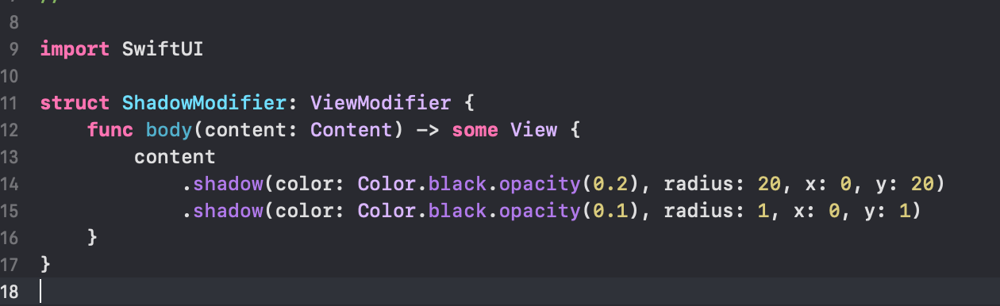

## 使用修饰符

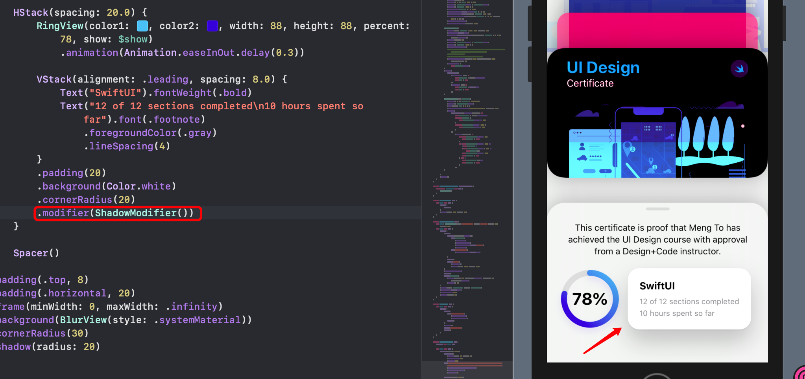

```swift
.modifier(修饰符文件名())
```

## 创建字体修饰符

```swift
struct FontModifier: ViewModifier {
    func body(content: Content) -> some View {
        content.font(.system(.body, design: .rounded))
    }
}
```

## 携带参数的修饰符

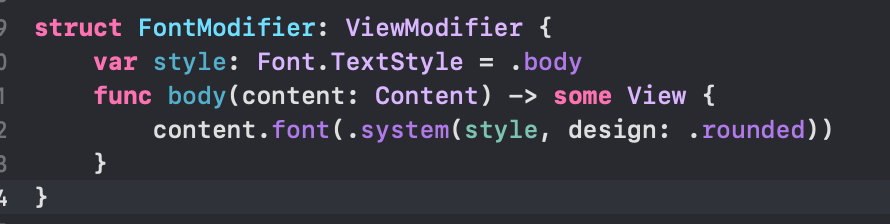

```swift
struct FontModifier: ViewModifier {
    var style: Font.TextStyle = .body
    func body(content: Content) -> some View {
        content.font(.system(style, design: .rounded))
    }
}
```

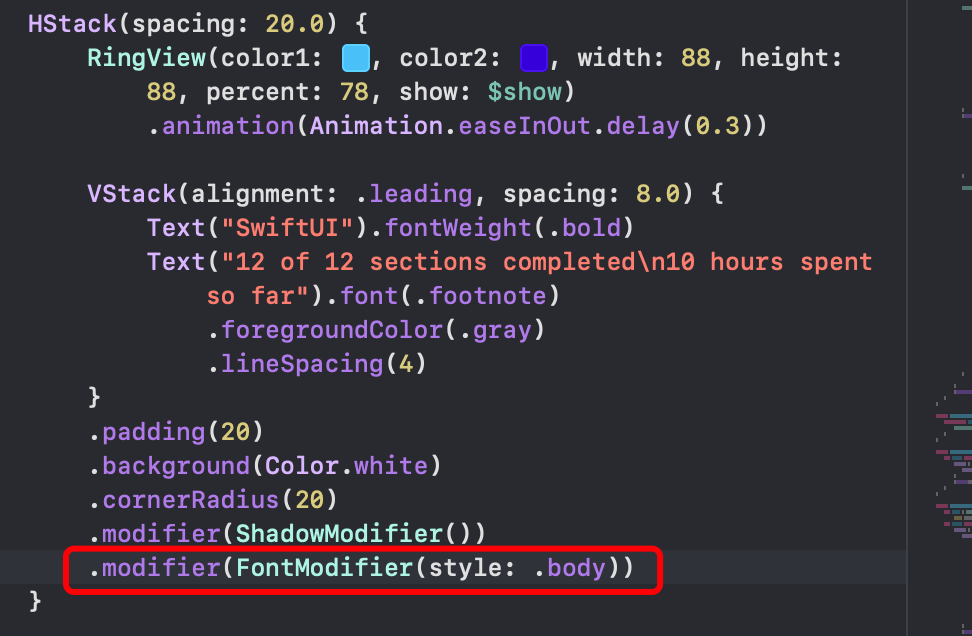

**TIPS**

修饰符可用于堆栈中，这样可给堆栈中所有view添加修饰。

## 创建自定义字体

进入 https://fonts.google.com/ 寻找免费字体：

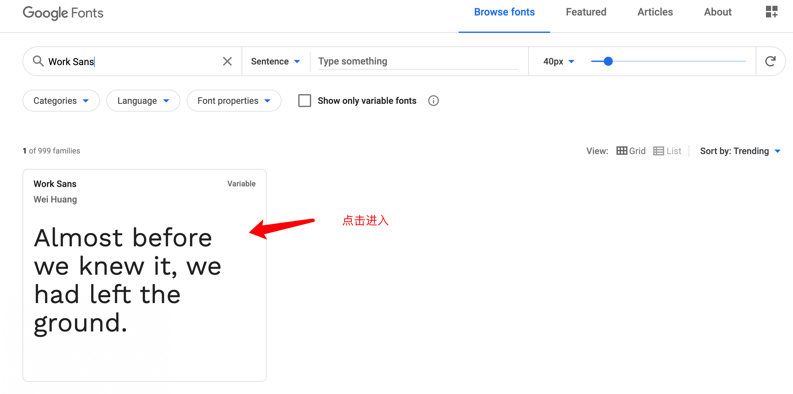


下载字体：

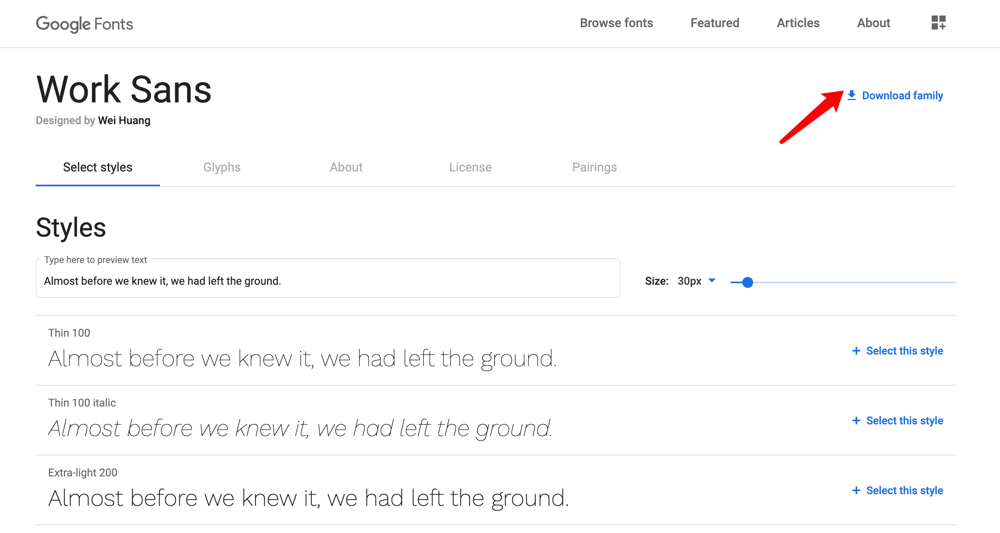

拖进项目：

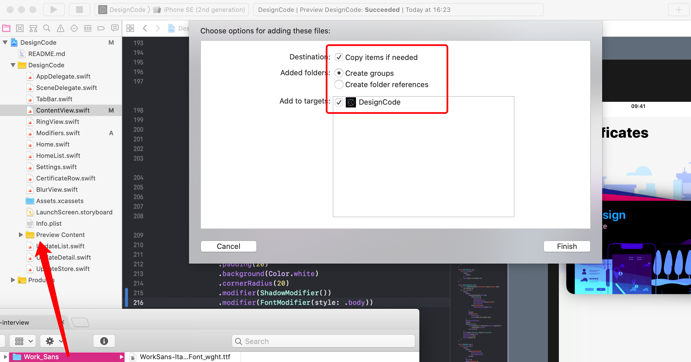

转到 `info.plist` 文件：

点击新增：

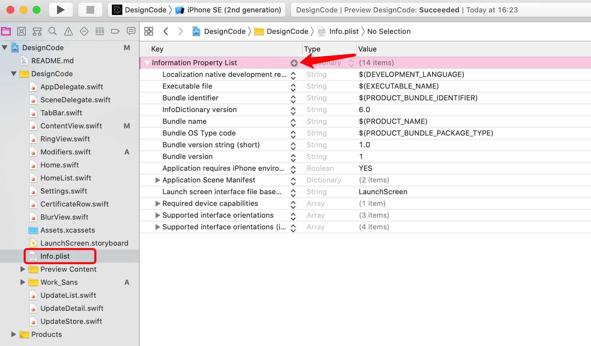

搜索 `Fonts provi...`

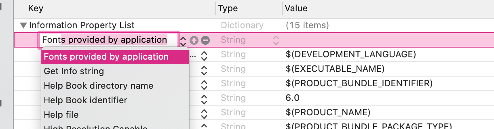

在数组中添加你想使用的字体名称：

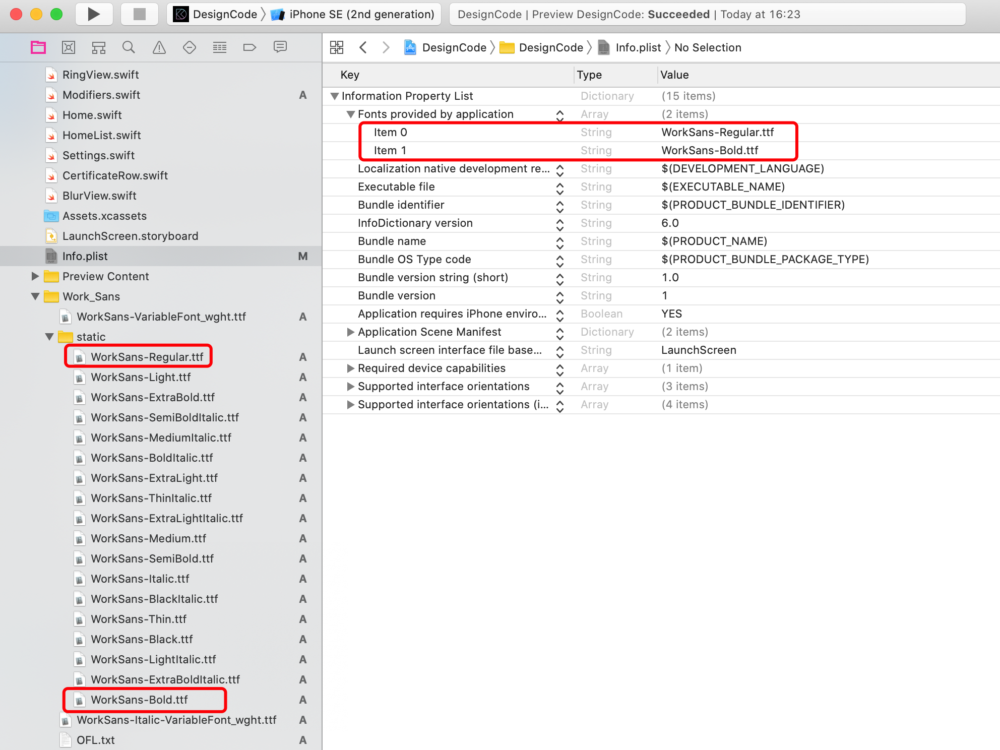

创建修饰符：

```swift
struct CustomFontModifier: ViewModifier {
    func body(content: Content) -> some View {
        content.font(.custom("WorkSans-Bold", size: 28))
    }
}
```

使用字体：


发现并没有变化，这是因为 modifier 上面的 font 优先级更高，所以删除就好了：

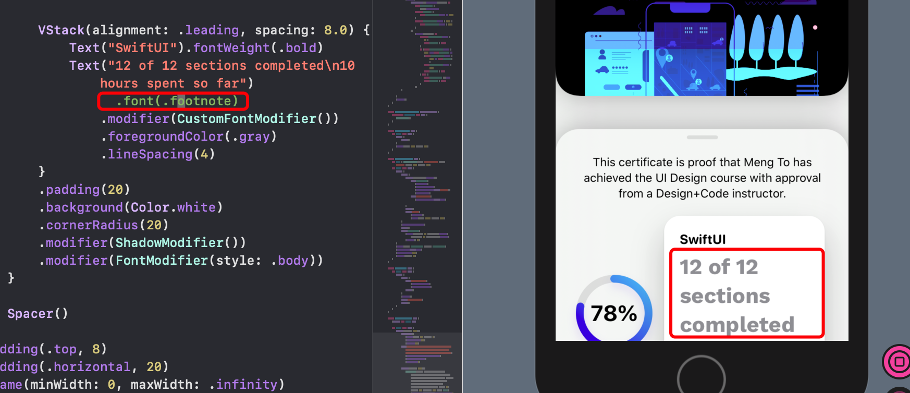

设置可自定义大小的字体：

```swift
struct CustomFontModifier: ViewModifier {
    var size: CGFloat = 28
    func body(content: Content) -> some View {
        content.font(.custom("WorkSans-Bold", size: size))
    }
}
```

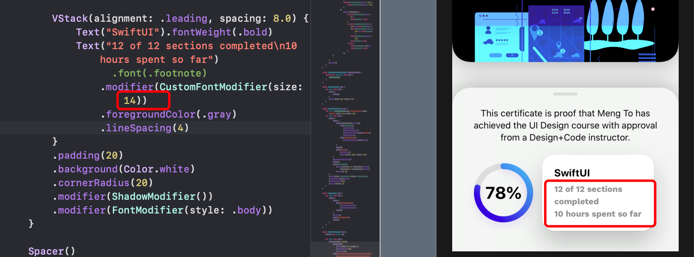

