# 创建应用

## 给App设置主题色

### 1. Assets.xcassets 中右键新建颜色

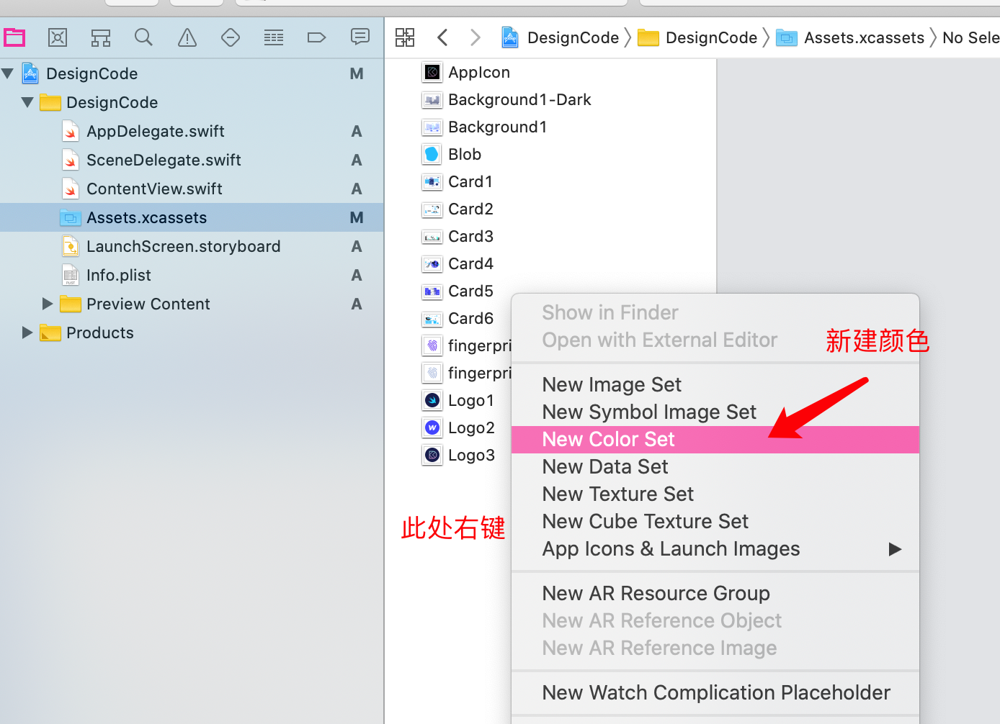

### 2. 选中并设置为十六进制模式

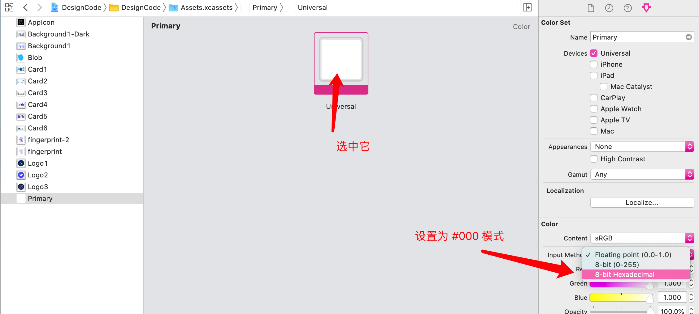

### 3. 设置夜间模式颜色

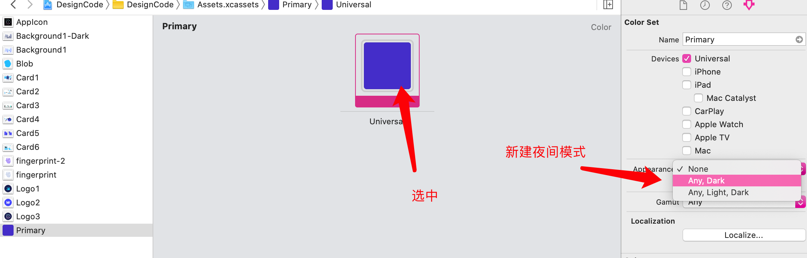

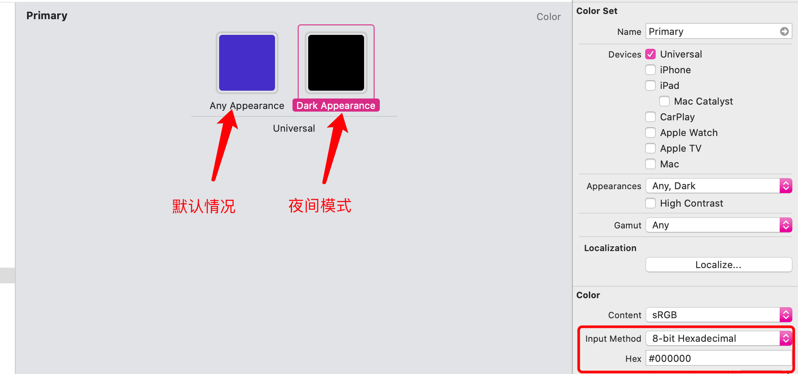

## 更改文本属性

### 1. 方法一

#### 选中文本

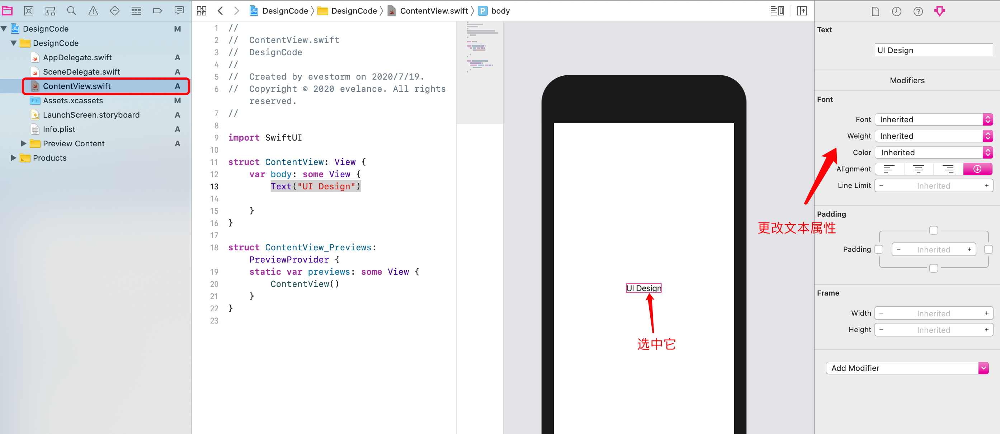

#### 更改右边属性后，代码区和预览区同步更新

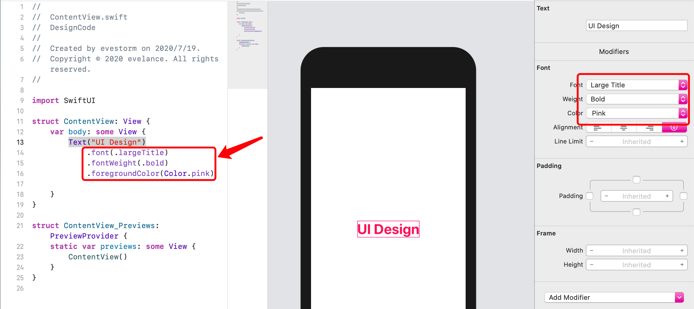

### 2. 方法二:或者按住Cmd选中文本

点击后就能更改了：

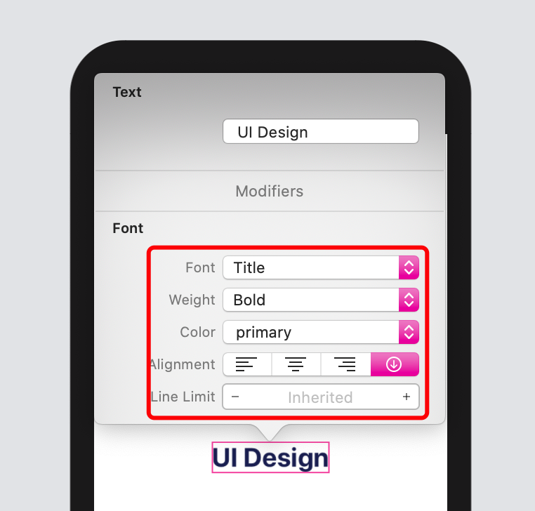

### 3. 在 Color 属性中还能找到我们刚刚设置的Primary

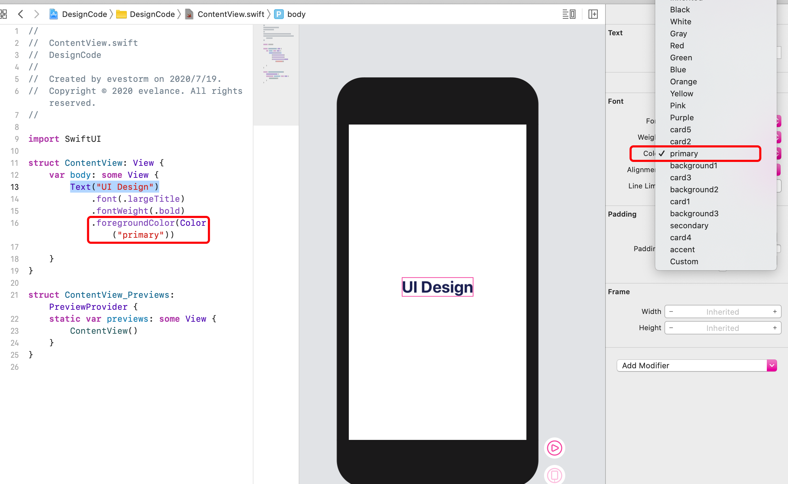

## 添加元素

### 1. 方法一: 点击右上角加号

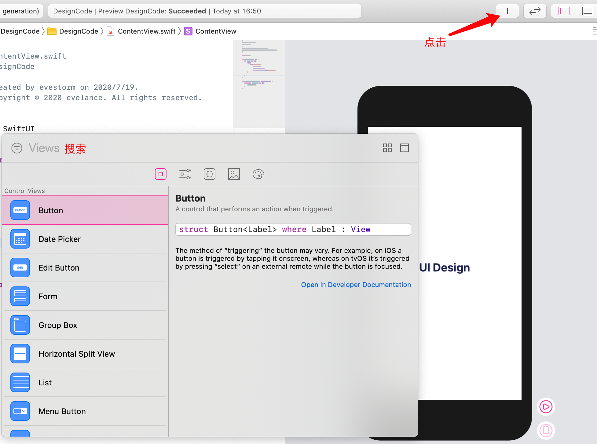

### 2. 方法二: Shift + Cmd + L

### 3. 拖拽目标元素到预览界面

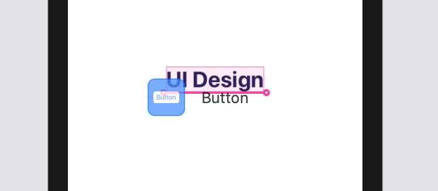

### 4. 添加图片

切换到图片一栏，选中目标图片拖拽到预览界面

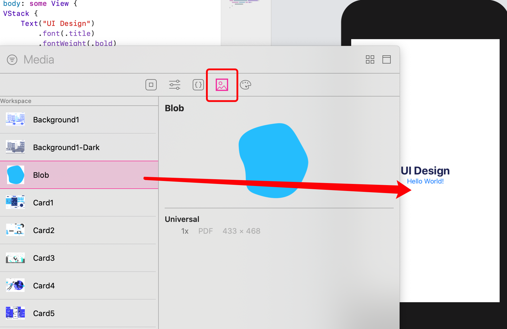

## 设置背景

Shift + Cmd + L 打开 panel 后选择第二项，模糊搜索 back 找到 Background 拖动到页面中。

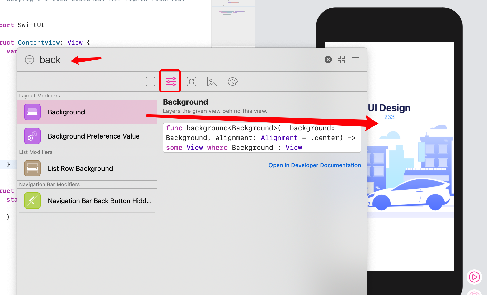

## 设置圆角

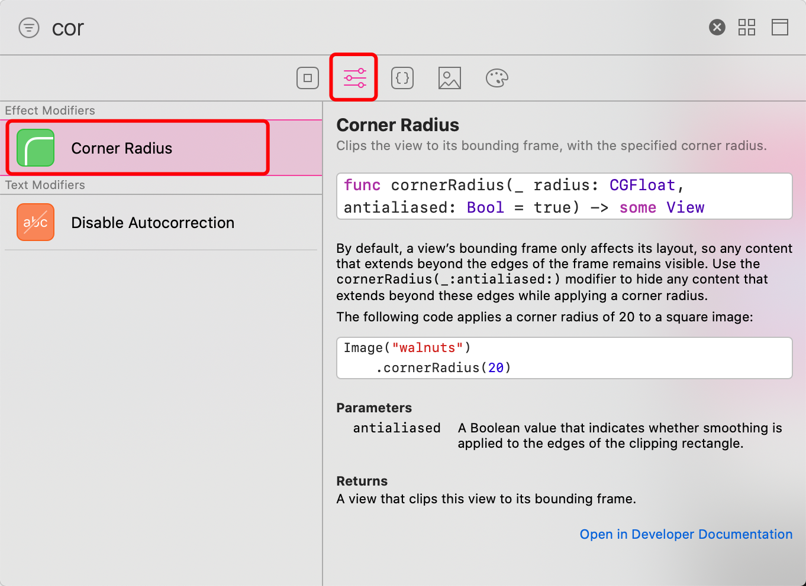

拖动到想要设置圆角的地方：

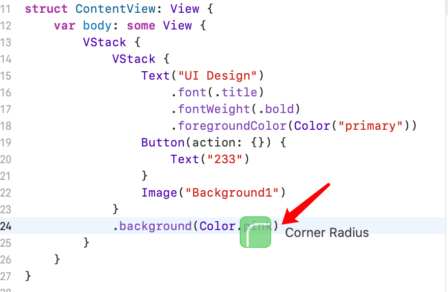

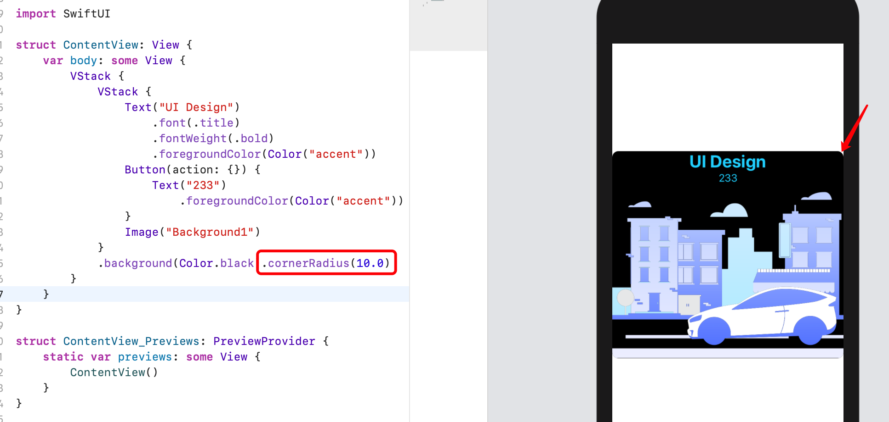

## 给元素设置边距

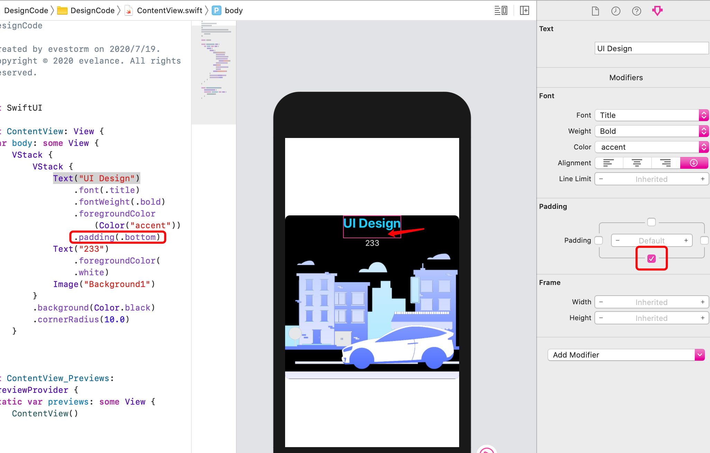

