# 组件和视觉效果

## 提取组件

Cmd+选中你要提取的组件，选择「Extract Subview」提取子视图：

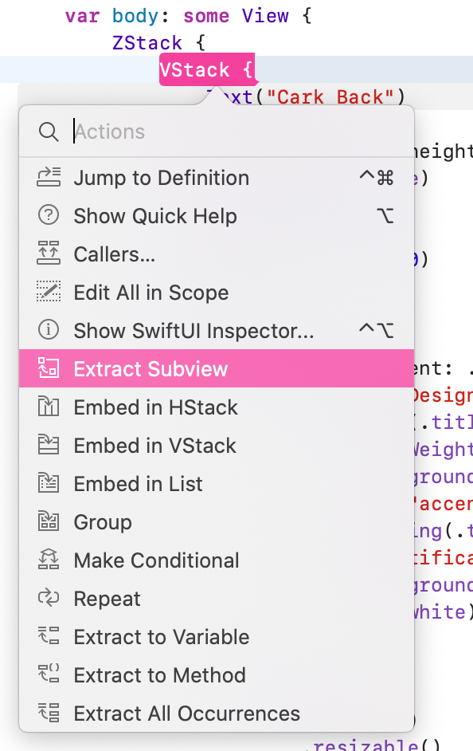

Xcode高亮了此组件让我们给它起个名字：

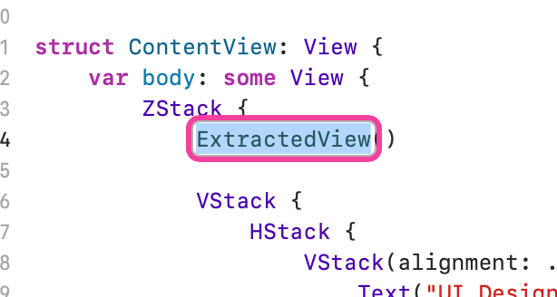

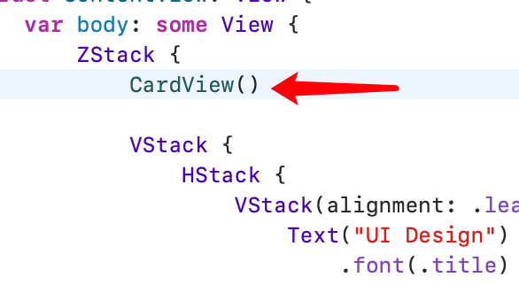

我们滚动到代码最底部，会发现 Xcode 帮我们创建好了 `CardView` ：

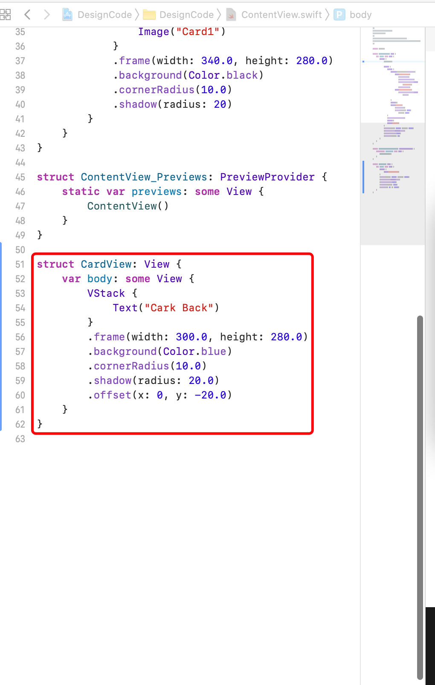

## 给组件设置修饰符

我们复制一个 `CardView` ，然后直接通过 `.` 的方式追加 `offset` 修饰符：

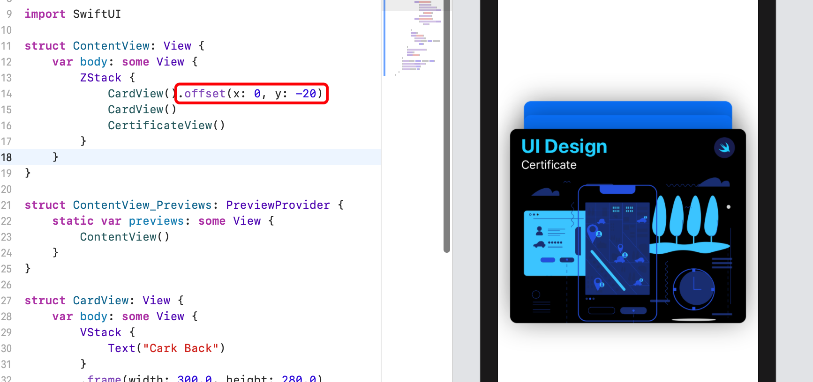

## scaleEffect 缩放视图大小

通过 `Shift + Cmd + L` 打开 Library ，在修饰符中搜索 `scaleEffect` 并拖动到代码中：

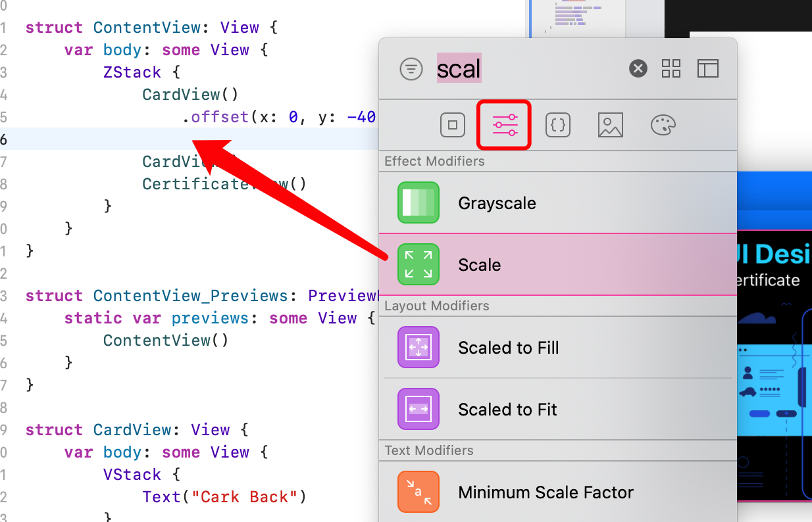

现在我们的卡片就堆叠在一起了：

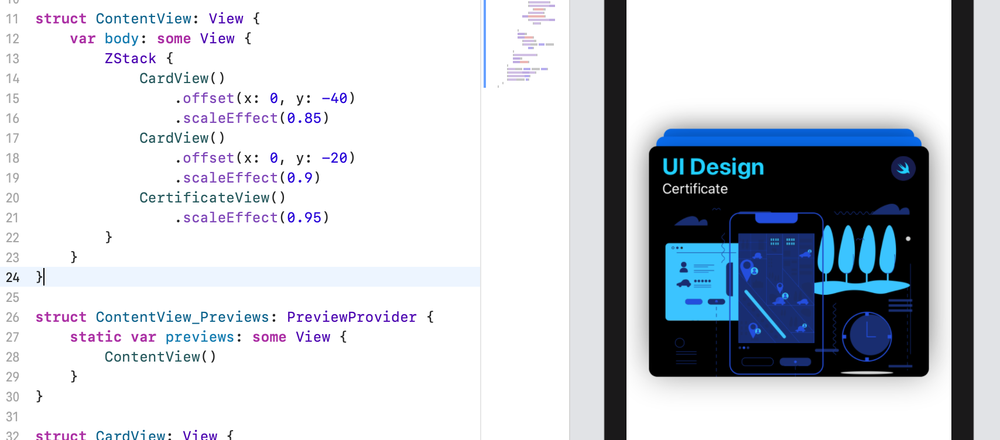

## rotationEffect 给视图添加旋转

`Shift + Cmd + L` 在第二项修饰符中搜索 `rotationEffect` ：

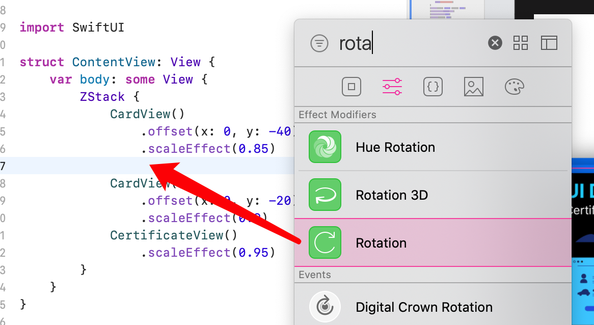

设置角度后保存：

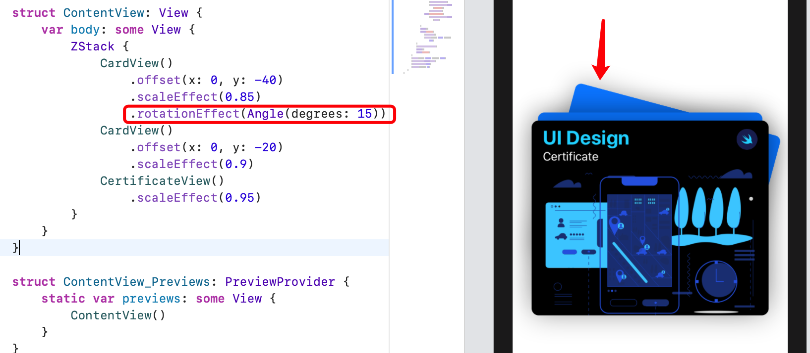

给三个卡片都设置上旋转效果：

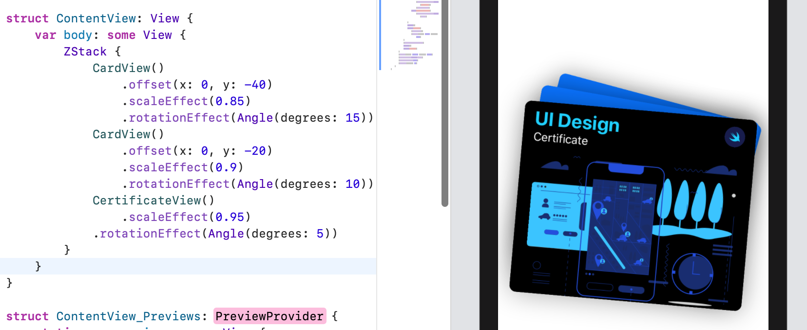

## rotation3DEffect 3D旋转效果

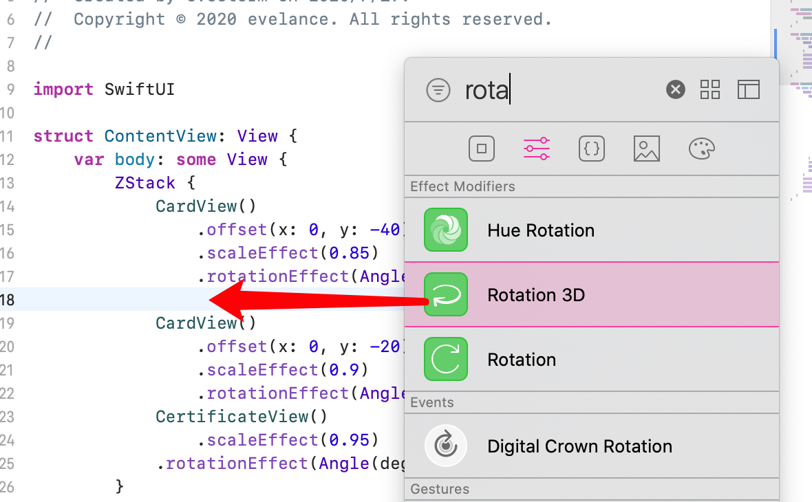

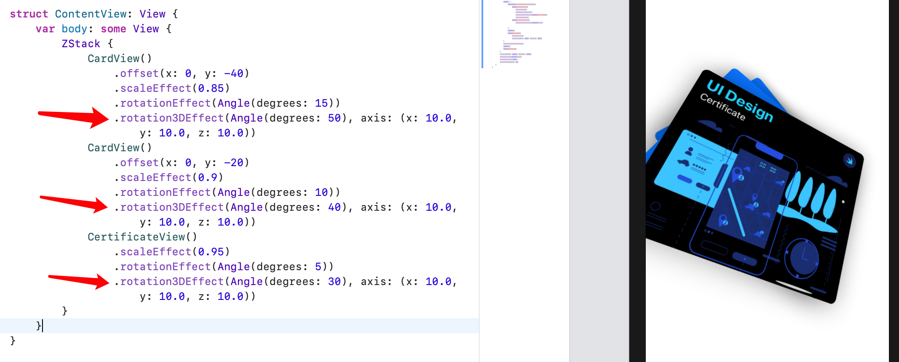

## blendMode 给视图添加混合模式

不了解混合模式是什么意思的，可以参考[此链接](https://zhuanlan.zhihu.com/p/74223972)

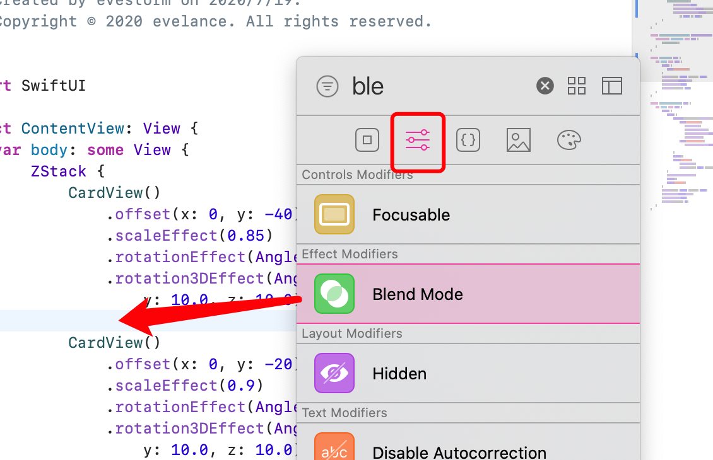

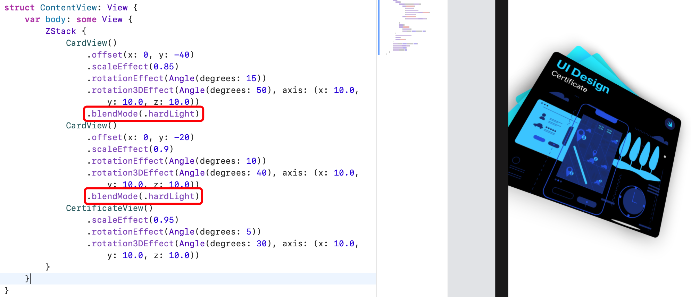

### lineLimit 限制文本行数


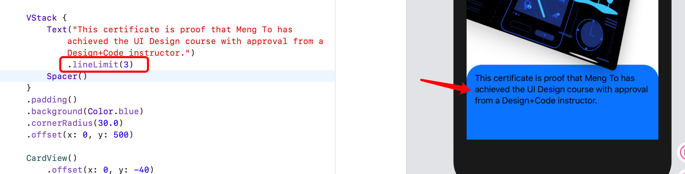

## Rectangle 设置长方形

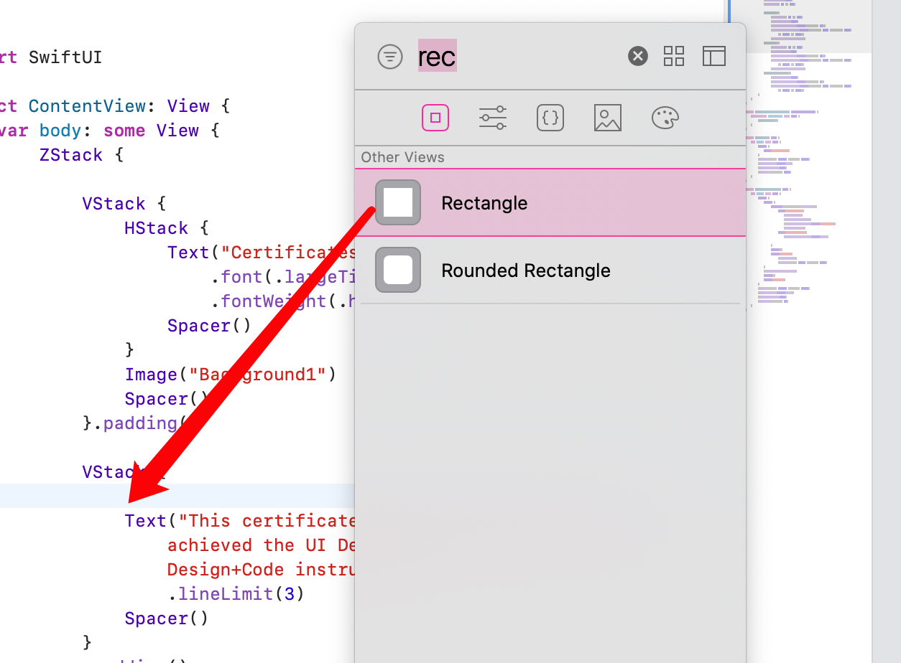

## opacity 给视图设置不透明度

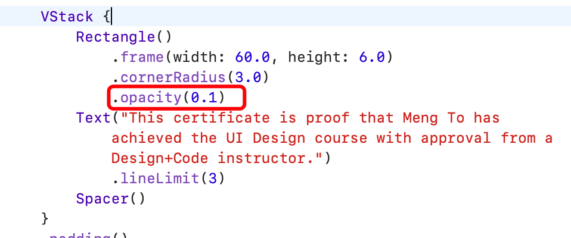

## 给 Stack 中每个视图之间都添加上间隔

Cmd + 点击 VStack 调出检查器：


设置间隔：

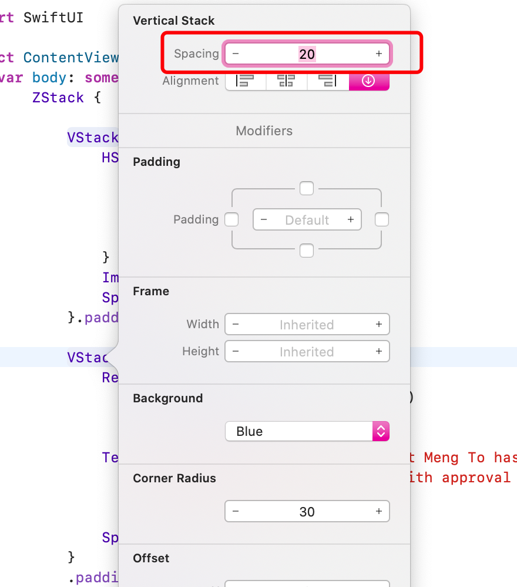

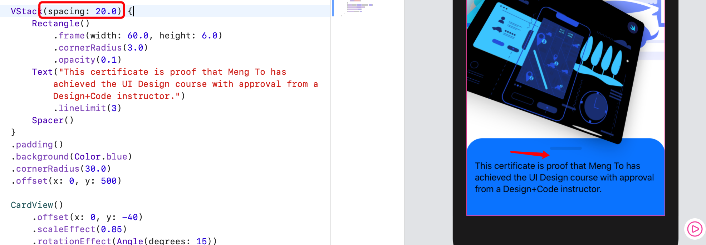

## 让视图宽度自适应

```swift
VStack(spacing: 20.0) {
    ...
}
.frame(minWidth: 0, maxWidth: .infinity)
```

表示最小0，最大撑满屏宽。

## blur 设置模糊效果

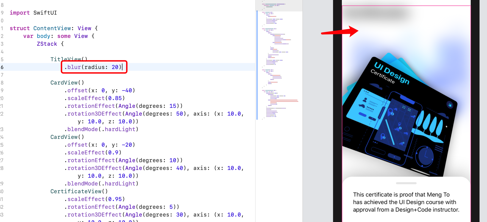

